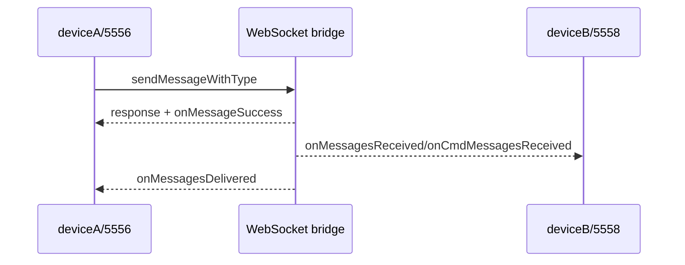
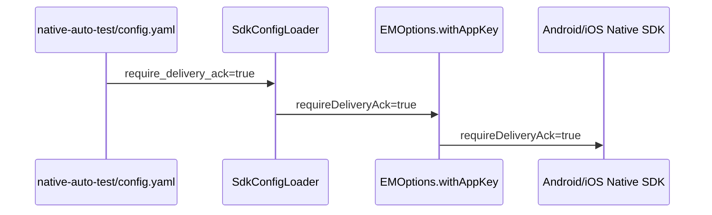

# Chat 单聊缺失 Case 第一批设计

## Overview

本批只补基础消息与送达通知，不修改 SDK、桥接或消息协议。测试通过已有 `ChatManager.sendMessageWithType` 与事件桥接，在 deviceA/deviceB 两个 WebSocket topic 上采集真实响应，随后冻结稳定字段。送达回执依赖测试 App 初始化时显式开启 `EMOptions.requireDeliveryAck`；配置由 `native-auto-test/config.yaml` 经 Flutter asset 和 `SdkConfigLoader` 传入 SDK。

## Architecture

- 测试入口：`native-auto-test/tests/chat/`。
- 发送端：deviceA（5556 对应 deviceA topic）。
- 接收端：deviceB（5558 对应 deviceB topic）。
- 消息类型：`location`、`voice`、`custom`。
- 送达回调：`onMessagesDelivered`，通过 `Cmd` 事件键读取。
- 配置源：`native-auto-test/config.yaml` 的 `sdk_options.require_delivery_ack`。
- 配置加载：`im_flutter_test/lib/sdk_config_loader.dart` 将 snake_case YAML 字段映射为 `EMOptions.withAppKey(requireDeliveryAck: ...)`。
- SDK/原生边界：沿用已有 Dart `toJson`、Android `setRequireDeliveryAck` 和 iOS `enableDeliveryAck` 实现，不增加新的 Wrapper API。

## Sequence diagrams

初始化配置链路：

## Component / Data / Workflow Design

- 复用 `test_chat_send_with_type.py` 的事件等待与 envelope 断言工具。
- 新增消息类型 helper 时只抽取稳定公共字段；媒体路径、secret、大小等按真实日志逐项决定是否忽略。
- 送达事件直接对 `receive_message` 原始返回值断言，消息 ID 使用真实 `onMessageSuccess` 中的 server msgId。
- 每个新增行为先以 `CASES_DISCOVER=1 WS_DEBUG=1` 运行，记录实际响应，再切换 strict。
- `SdkConfigLoader` 通过 Flutter test 直接加载真实 asset，断言 `options.requireDeliveryAck == true`，防止配置字段或映射再次遗漏。

## Constraints / Tradeoffs

- 不假设文档中的 Robot 字段等于 Flutter 返回字段。
- 不把 `onMessageSuccess` 当作送达通知；必须出现 `onMessagesDelivered` 才算送达覆盖。
- 语音/位置的媒体和经纬度字段以当前模拟器真实日志为准。
- `requireDeliveryAck` 保留 SDK 默认 `false` 的通用语义；仅由测试配置显式设为 `true`，避免改变发布 SDK 默认行为。
- 配置随 APK asset 打包，修改后必须重新构建、覆盖安装并重启两台测试 App 才会生效。

## Testing Strategy

1. 先运行目标 case 的 discovery 模式。
2. 根据完整日志冻结 envelope、关键 result、事件类型、消息 ID 关联。
3. 关闭 discovery，运行同一文件 strict 回归。
4. 更新 Chat cases 台账和本 spec tasks 状态。
5. 送达开关适配先执行 Flutter 配置加载回归测试和 `flutter analyze`，再构建 Android debug APK。
6. 覆盖安装并重启两台模拟器后，只复跑送达回执相关 strict case；同时核验 `onMessagesDelivered`、消息 ID 关联和 `hasDeliverAck`，不根据失败结果放宽预期。
7. 对受配置影响的既有 case 按事件阶段逐项更新 `hasDeliverAck`，不做全文件机械替换。
8. 对 `fetchPinnedMessages` / `pinnedMessages` 先从原始结果中按本次 msgId 构造目标投影，再对投影做完整字段断言；取消置顶后只要求目标投影为空。
9. 对 `targetLanguages` 文本等待匹配内容的 `onMessageSuccess`、接收消息与送达事件，并严格断言 `translations` 包含目标语言的非空字符串。
10. 修复后先按问题组单独严格回归，再将用户指定的 14 条放在同一 session 中回归，暴露共享状态或时序竞争。
11. `Client.login`、`loginWithAgoraToken` 和 `logout` 在测试桥接中使用公开 Dart `EMClient` API 分发，不再直接透传 interface `callNativeMethod`；这样原生操作与 Dart `_currentUserId` 的更新/清理由同一公开 API 完成。
12. 增加 Flutter bridge 命令级回归测试：先用公开 API建立旧用户缓存，再通过真实本地 WebSocket 向 bridge 发新用户登录命令，验证 `EMClient.currentUserId` 已刷新；测试使用 fake interface client 隔离原生设备。
13. translation 边界 case 的消息准备同时检查匹配临时 msgId 的成功和错误终态；业务预期仍是自定义消息发送成功后，显式翻译返回 `1 General error`。

## Remaining Document Coverage

- 将 Mobile/WebIM 重复场景按一种业务语义实现和统计。
- 按模块分批补齐文本边界、消息置顶、举报、会话置顶/标记、消息修改、翻译、缩略图和漫游消息过滤。
- 需要服务端开关的场景先做能力探测；未开启时进入 deferred，不以关闭态错误作为验收值。
- Flutter SDK 未暴露 Robot/WebIM 参数时，记录接口语义差异，不构造无效桥接字段冒充覆盖。
- 当前 5554/5556 AppKey 的翻译和 delivery receipt 均已开启；本批未发现需要用户开启的新服务能力。
