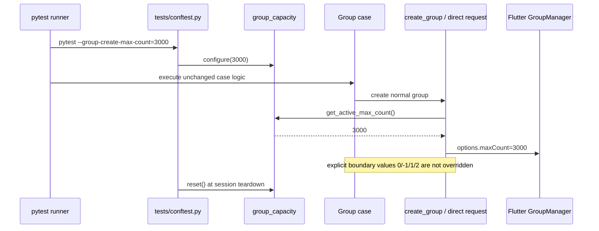

# Group 容量场景参数化设计

## Overview

Group case 保持一份源码，通过 pytest 命令行参数选择常规建群容量。默认参数值为 `200`；扩容场景由 `--group-create-max-count=3000` 显式启用。实现只改 `native-auto-test` 的测试辅助层和直接构造常规建群请求的 Group lifecycle case，不修改 Flutter SDK 或测试 App。

## Architecture

- `src/tools/group_capacity.py` 是容量场景的唯一运行时状态入口，提供默认值、配置、读取、重置和正整数校验。
- `tests/conftest.py` 注册 `--group-create-max-count`，在 pytest 配置钩子中配置容量状态、在 unconfigure 钩子中重置状态；默认值固定为 `200`，非法值在 collection 前被拒绝。
- `tests/group/group_helpers.py` 的 `create_group()` 在调用方未显式传入 `max_count` 时，读取当前容量场景；显式容量仍优先。
- `tests/group/test_group_exceptions_lifecycle.py` 将直接创建的常规群和对应预期断言接入同一读取入口；容量边界 case 保持其显式数值。

## Sequence Diagram

## Component and Workflow Design

`group_capacity` validates that configured values are positive integers. It starts at 200, so existing invocations and ordinary `pytest tests/group` runs retain their exact capacity. The fixture configuration is session-scoped because the capacity is a run scenario, not a per-case data dimension.

`create_group(max_count=None)` distinguishes omitted capacity from an intentional value: omitted resolves to the active scenario capacity; an explicit integer is used literally. This preserves capacity-boundary cases. Direct lifecycle create requests use a small runtime helper to build normal options, ensuring their request payloads and strict `maxUserCount` expectations follow the selected scenario.

The capacity-3000 scenario is run as a separate CI job/report directory rather than being added to default group regression. This keeps standard runtime stable and labels results by scenario while testing the same functions.

## Constraints and Tradeoffs

- Do not duplicate test files, parameter matrices, or test names. Duplicate code would drift as Group coverage evolves.
- Do not rewrite capacity-focused values (`0`, `-1`, `1`, `2`); doing so would invalidate their failure/full-capacity semantics.
- A process-global selected capacity is safe because pytest executes one scenario per process/job. Parallel scenarios must use separate pytest processes.
- Existing user changes in `test_group_exceptions_lifecycle.py` must remain intact.

## Testing Strategy

1. Unit-test the capacity state default, valid override and non-positive rejection without contacting test devices.
2. Run the unit test red before implementation, then green after adding the utility.
3. Run Group test collection checks and targeted Group helper/lifecycle imports with the default capacity.
4. Run a small real Group creation subset with `--group-create-max-count=3000` in discovery mode, then strict mode after freezing the returned `maxUserCount=3000` evidence.
5. Record only commands and non-sensitive results in the Group case ledger.
