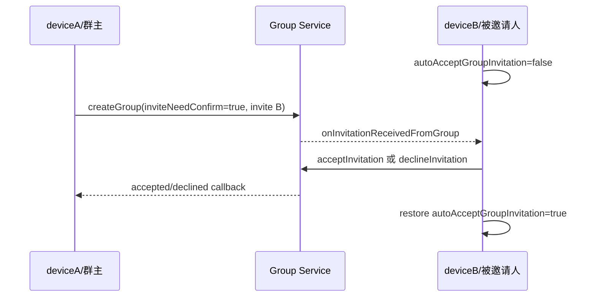
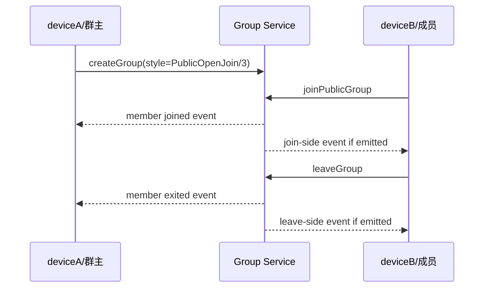
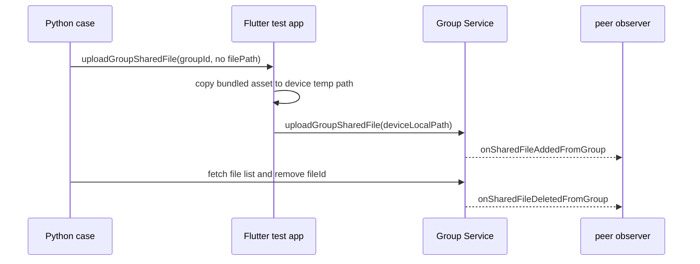
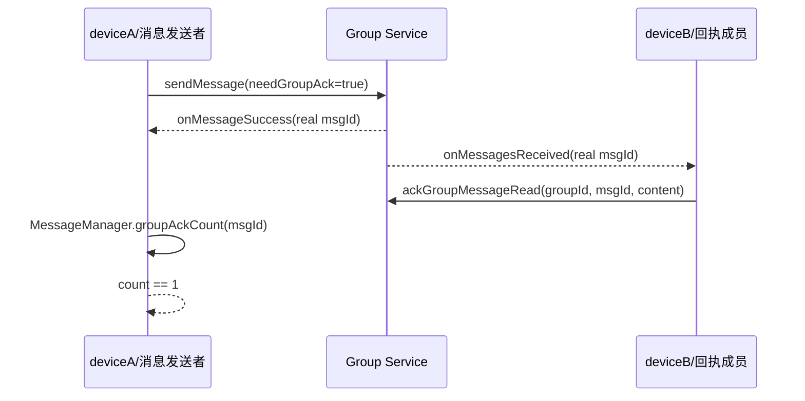

# Group 缺失 Case 补齐设计

## Overview

本批使用现有 SDK、通用 WebSocket bridge 和双 Android 模拟器补齐 Group API 的群类型、邀请/申请、角色权限和状态迁移矩阵。实现不修改发布 SDK；仅在 Python cases 中编排 SDK options、四种群类型、角色和状态迁移。所有事件字段先以 discovery + ADB 日志确认，再写入 strict 断言。

## Architecture

- 用例端：`native-auto-test/tests/group/`，负责场景编排、同步响应、双端事件和服务端快照断言。
- 测试端：`im_flutter_test/lib/bridge/im_websocket_bridge.dart`，仅为 `uploadGroupSharedFile` 在未传路径时准备 Android 本地测试素材。
- 设备：deviceA 对应 `emulator-5554`，deviceB 对应 `emulator-5556`；分别抓取 logcat。
- 安装约束：5554 覆盖安装新 APK 实测因设备空间不足失败；共享文件缺省路径 bridge 仅由
  已安装新 APK 的 5556 执行。群主场景让 B 建群，管理员场景让 A 建群并提升 B，5554
  只承担真实事件观察者，因此不改变双设备业务断言或发布 SDK。
- 证据：`native-auto-test/out/group_completion_<timestamp>/` 保存 case 输出和 A/B ADB 日志，台账引用证据目录。
- 权威任务状态：本 spec 的 `tasks.md`。

## Sequence Diagrams

### 显式邀请处理

### 公开群加入退出

### 共享文件

## Component / Data / Workflow Design

### Invitation matrix

- `inviteNeedConfirm=false + autoAccept=true`：现有直接入群链路保留。
- `inviteNeedConfirm=false + autoAccept=false`：新增直接入群链路，验证该群设置优先于受邀端 option。
- `inviteNeedConfirm=true + autoAccept=true`：新增自动接受组合。
- `inviteNeedConfirm=true + autoAccept=false`：新增显式接受与显式拒绝组合。
- 每个切换全局 option 的 case 使用 `try/finally` 恢复 `true`。
- 四种 style 均覆盖群主邀请；`style=0/1` 额外覆盖普通成员和管理员权限差异。
- 使用 `user_c` 作为不要求事件的 owner/成员状态账号，可通过“建群 -> 邀请 B/C -> 转让给 C -> A 退出”让 A/B 两台真实设备分别成为受邀方和普通成员邀请方。

### Public group matrix

- 成功：`style=3`，B join 后由 B leave。
- 申请：`style=2`，覆盖合法/空原因、同意、拒绝、重复申请和无 pending 处理。
- 错误映射：`joinPublicGroup` 对 `style=0/1/2`，`requestToJoinPublicGroup` 对 `style=0/1/3`，分别冻结真实错误。
- 成功链路分别断言 A/B 事件，事件集合和字段以当次 ADB discovery 为准。

### Ownership and removal matrix

- 转让目标：普通成员、管理员、当前 owner、非成员、不存在用户和空字符串。
- 操作者：owner、管理员、普通成员和非成员；仅公开 API 明确允许的角色应成功。
- 转让后验证 owner、adminList、memberList，并让新旧 owner 分别执行 owner-only 操作确认权限迁移。
- “移除群主”拆成两个独立语义：移除当前 owner 必须失败；转让后新 owner 移除原 owner 应成功。
- `removeMembers` 覆盖普通成员、管理员、当前 owner、越权调用和混合批量请求；部分成功或原子失败由 ADB discovery 冻结。

### Stateful boundary matrix

- Join/application：重复 join、重复申请、已是成员、群满、黑名单用户。
- Application processing：无 pending、重复同意/拒绝、同意后拒绝、拒绝后同意。
- Invitation processing：有效群无 pending、错误 inviter、重复接受/拒绝和交叉处理。
- 所有失败场景在操作后拉取服务端快照，并为可能出现的成功事件设置独立负向等待窗口。

### Joined-list transitions

- 通过本次 groupId 在完整列表中做目标投影，投影 expected 来自前置 create 响应，而不是来自待断言的 actual。
- 覆盖 direct invite、owner remove、re-add、member leave 后的本地/服务端出现与消失。
- 仅在最终一致性边界使用固定 1~2 秒等待。
- Discovery 确认 `addMembers` 即使传入非空 `welcome`，B 的自动接受事件 `inviteMessage`
  仍为空字符串；case 按该真实回调冻结，不把请求值直接当成事件预期。

### Public cursor pagination

- 创建两个 `style=3` 临时公开群，`pageSize=1` 从空 cursor 开始拉取。
- 每次直接断言原始响应 envelope 和 cursor/list 结构，并使用前置创建得到的 groupId 关联本次数据。
- cursor 非空才继续，直到找到两个目标群或 cursor 为空；设置明确最大页数防止死循环。

### Announcement roles

- 群主更新：A 操作，B 观察。
- 管理员更新：先将 B 设为管理员，B 操作，A 观察。
- 操作者侧是否收到事件不做先验假设，必须通过独立 ADB 窗口确认后冻结。

### Shared-file roles and material

- bridge 只在 `GroupManager/uploadGroupSharedFile` 且 `filePath` 未传或为空时，将现有 `assets/media/bigPic.jpg` 复制到设备临时目录并注入路径。
- 群主链路：A 上传/删除，B 观察事件。
- 管理员链路：B 设为管理员后上传/删除，A 观察事件。
- Discovery 已确认 `fileId/createTime` 动态；新增事件的 `fileName` 被服务端改写为动态
  `{b62:...}`，服务端列表则恢复原始 `bigPic.jpg`。case 分别断言两种表示，并对固定
  `fileOwner/fileSize` 以及事件/列表/删除链路中的同一 fileId 做严格关联。

### Group state

- Flutter/Android/iOS 当前只有状态事件监听，没有客户端启用/禁用 API。
- 保留 deferred，恢复条件为可控 REST、管理后台或服务端操作入口；不在本批添加假事件或测试专用 SDK API。

### Group message sending

- 新增 `tests/group/test_group_message_send.py`，作为群会话发送与群消息回执的唯一归档文件。
- 普通类型矩阵覆盖 `txt/file/image/video/voice/location/cmd/custom`；每个参数独立建群并由 A 发送、B 接收，避免一个类型失败遮蔽后续类型。
- `combine` 先在同一群内发送两条文本消息并取得真实服务端 msgId，再发送合并消息，严格关联 `title/summary/compatibleText`。
- 发送响应和 `onMessageSuccess` 使用临时 msgId，接收事件使用服务端真实 msgId；两端统一冻结 `chatType=1` 和 `convId=groupId`。
- 媒体消息继续复用测试 App 的默认素材准备，不新增 SDK 或 bridge 行为；仅动态路径、secret、文件大小和时间字段进入最小忽略集。
- ChatThread API case 与用于创建 thread 的群父消息前置链路统一放在 Group 文件，便于按真实群组设备场景归档；父消息不计入独立群消息发送矩阵。原 ChatManager 群回执测试同样归档在 Group 文件。

### Group message read-ack count

- 继续使用 `tests/group/test_group_message_send.py` 作为群消息与群回执的唯一归档文件。
- A 建群并发送 `needGroupAck=true` 的文本消息，B 收到服务端真实 `msgId` 后调用 `ackGroupMessageRead`。
- A 使用同一 `msgId` 有界轮询 `MessageManager/groupAckCount`，只以原始响应中 `result=1` 作为通过条件。
- 本轮不等待群回执回调，不查询 `asyncFetchGroupAcks`，不扩展非法 ID 回执边界。

### Group message boundary matrix

- 在 `tests/group/test_group_message_send.py` 继续归档群发送异常，避免同一业务主题拆散。
- 目标维度：空 groupId、不存在 groupId；使用 A 发送文本，B 观察无误投递。
- 成员状态维度：B 从未入群、B 主动退出后、B 被 A 移除后；使用 B 发送文本，A 观察无误投递。
- 每次发送先获取同步响应临时 msgId，再同时监听匹配 ID 的 `onMessageSuccess` 与 `onMessageError`；只接受 discovery 冻结的唯一错误 code/description。
- 群成员变更操作继续严格断言 GroupManager 同步响应、双方群事件和服务端成员状态，发送失败不能替代成员状态前置验证。
- 类型构造边界由 Chat 公共发送 API 覆盖；Group 只补 chatType 影响的目标与成员权限，不重复媒体路径和动态类型错误。

## Constraints / Tradeoffs

- 不修改 `im_flutter_sdk/`、Android/iOS Wrapper 或发布 API。
- 全局 options 切换会影响同设备后续测试，必须在 `finally` 恢复。
- 公共群列表可能包含共享环境历史数据，因此只关联本次创建的 groupId，并限制 cursor 遍历深度。
- 共享文件素材复用测试 App 已有 asset，避免引入新生产依赖。
- ADB 日志可能包含账号或网络信息，归档和总结时必须脱敏，不输出 token、密码和 cookie。
- 当前环境不使用服务端 tracelog；discovery 证据仅来自 pytest 原始响应和 deviceA/deviceB 的真实 ADB logcat。
- 管理员接收入群申请回调与管理员是否可处理申请的 Dart 注释存在差异，该项不预设放宽结果，以真实原生响应形成 strict case。
- 已诊断的 7 个参数场景按用户决定暂时使用精确 `pytest.mark.skip` 隔离；case 主体、严格断言和
  ADB 证据继续保留。参数化函数只标记问题参数，不跳过同函数内其他组合。

## Testing Strategy

1. 先为 bridge 的设备素材准备行为增加 Flutter RED 测试并确认按预期失败。
2. 对每条 Python case 先写场景文档和预期业务断言框架，以 discovery 模式运行，确认缺失行为或实际回调。
3. 同步抓取 A/B logcat，将真实事件类型、字段、事件接收端和无事件端写入 strict 断言。
4. 每完成一类场景，关闭 discovery 跑目标 case 和目标文件。
5. bridge 改动后执行 Flutter 单测、`flutter analyze` 和 Android debug 构建；在具备新
   bridge 的上传操作设备上验证设备本地素材路径，并由另一真实设备验证对端事件。
6. 最终执行 `pytest -q tests/group`，检查失败/skip 数量、台账对账和 deferred 仅剩真实外部阻塞项。
7. 已知问题隔离后单独选择 7 个 nodeId，验证结果必须精确为 `7 skipped`；不以 xfail 或放宽断言替代。
8. 群消息整理只运行新文件、迁移后的原文件收集和必要的定向真实设备 case；按用户要求不重复运行完整 Chat/Group 套件。
9. 群发送边界逐条执行 RED/discovery/strict；成员状态 case 同步保留 A/B ADB 日志，仅在出现预期外行为时用于诊断，不使用 tracelog。
10. 群回执 count case 只在 B 成功 read-ack 后轮询 A 的 `MessageManager/groupAckCount`，严格断言同步响应信封和 `result=1`。
11. 运行该 count case strict 验证；不以回调、回执明细列表或非法 ID 结果作为本轮验收项。
