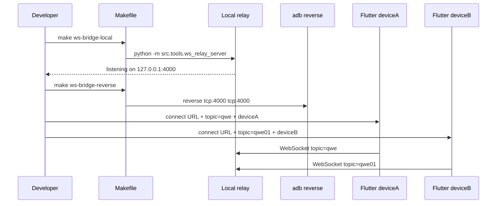
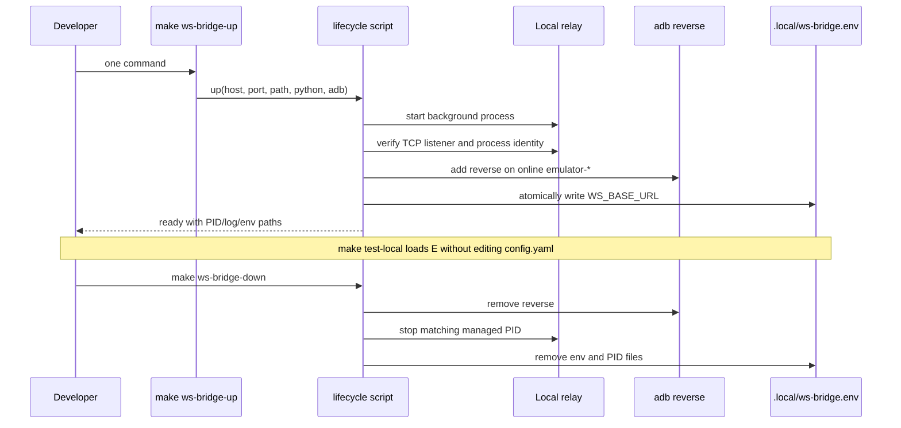
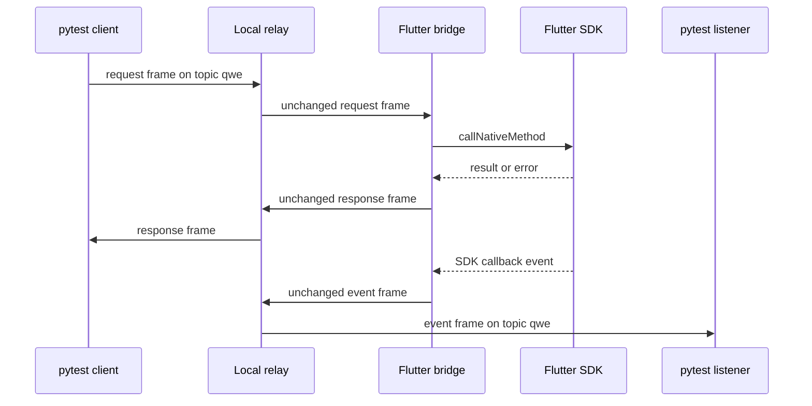

# 本地 WebSocket 测试桥接服务设计

## Overview

在 `native-auto-test` 内新增一个轻量 Python WebSocket relay，替代 E2E 控制链路对公共桥接服务器的强依赖。服务仅负责按 topic 转发透明 WebSocket 帧，不解析 SDK 请求、不保存历史、不承担 IM SDK 的 MSync、Gateway 或 `syncDataWebSocketServer` 职责。

本方案复用 `native-auto-test` 已有的 Python 3.9+ 与 `websockets>=11.0` 依赖。保留前台服务和独立 reverse 命令用于诊断，同时提供 `ws-bridge-up/down` 全自动生命周期入口。自动入口只写 Git 忽略的 `.local/` 状态，不修改 App 页面配置、`config.yaml`、REST 配置或业务账号。

## Architecture

- `native-auto-test/src/tools/ws_relay_server.py`
  - 实现 relay 核心、topic 连接注册表、路径和 topic 校验、帧转发、连接清理与 CLI。
  - CLI 默认参数为 `--host 127.0.0.1 --port 4000 --path /iov/websocket/dual`。
  - 使用当前安装版本兼容的 `websockets` server API，不增加运行依赖。
- `native-auto-test/Makefile`
  - 新增 `ws-bridge-local`，通过 `$(PY) -m src.tools.ws_relay_server` 启动前台服务。
  - 新增 `ws-bridge-reverse`，调用独立脚本完成模拟器端口映射。
  - 新增 `ws-bridge-up`、`ws-bridge-down` 和 `test-local`，分别管理全自动生命周期和加载本地 pytest 地址；`test-local` 在运行 pytest 前调用 lifecycle health check。
- `native-auto-test/scripts/adb_reverse_ws_bridge.sh`
  - 查找 Android SDK `adb`，筛选 `adb devices` 中状态为 `device` 且序列号以 `emulator-` 开头的设备。
  - `add` 模式对每个目标设置 reverse 并回读；`remove` 模式只删除目标端口映射且允许当前没有在线模拟器。
- `native-auto-test/scripts/ws_bridge_local.sh`
  - `up` 先获取状态目录互斥锁并验证 Python 依赖，再在后台启动并验证 relay，调用 reverse add，原子写入 PID 和环境文件；失败时回滚本次创建状态。
  - `check` 从环境文件恢复实际运行参数，验证 PID、进程身份和真实 WebSocket 握手。
  - `down` 从环境文件恢复实际运行参数，调用 reverse remove，仅停止身份匹配的 PID；仅在全部成功后删除 PID/环境文件，失败时保留管理状态供重试。
- `native-auto-test/.local/`
  - Git 忽略的机器本地持久状态：`ws-bridge.pid`、`ws-bridge.env`、`ws-bridge.log`；lifecycle 操作期间还会临时创建 `ws-bridge.lock/`。
- `native-auto-test/src/tools/config.py`
  - `get_ws_base_url()` 优先读取去除首尾空白后的 `WS_BASE_URL`；空值回退到现有 YAML 配置。
- `native-auto-test/tests/tools/`
  - 放置不依赖设备和外部网络的 relay 集成测试及配置优先级单元测试。
- `native-auto-test/README.md`
  - 记录启动、连接、验证、运行 pytest 和恢复远程地址的完整流程。

## Sequence Diagrams

### 本地启动与设备连接

### 全自动生命周期

`down` 和 `check` 不信任调用者重复提供的端口/path，而是把 `.local/ws-bridge.env` 中的 `WS_BASE_URL` 作为已启动实例的权威状态。这样使用自定义端口启动后，即使 down 未重复传参，也能定位并停止原实例。环境文件缺失或格式非法时不得猜测并删除仍在使用的管理状态。

### 请求、响应与事件转发

## Component and Data Design

### Relay registry

Relay 维护进程内映射 `topic -> set[connection]`。连接握手完成后，从请求 URI 中读取 path 和 query：path 必须与 CLI 配置一致，`topic` 必须存在且去除空白后非空。合法连接加入对应集合；连接结束时在 `finally` 中移除，空集合对应的 topic 一并删除。

每个入站帧以 `str` 或 `bytes` 原类型发送给同 topic 的其他当前连接。服务不 JSON decode，因此请求、响应、事件和未来新增字段均保持透明。单个目标发送失败只移除失败连接，不中断其他目标；没有其他订阅者时直接等待下一帧。

### CLI and lifecycle

CLI 提供 `--host`、`--port` 和 `--path`，对端口范围、path 格式做启动前校验。启动日志打印最终监听 URL。进程在前台运行，由开发者通过 `Ctrl-C` 停止；退出时关闭监听器和活动连接并等待清理完成。自动 up 在创建后台进程前使用同一 Python 导入 `websockets` 与 relay 模块；自动 check 使用真实 WebSocket 握手而非仅做 TCP connect。

CLI 与 lifecycle 对 host、port、path 使用一致的边界：host 非空且不含空白，port 为 `1..65535`（仅内部测试入口允许 `0`），path 以 `/` 开头且不含 query、fragment 或空白。项目继续使用 legacy API 以兼容现有 `ws_client.py`，并在依赖中设置上限，保证重建虚拟环境不会解析到已删除该 API 的版本。

### Lifecycle lock

`ws_bridge_local.sh` 使用 `WS_STATE_DIR/ws-bridge.lock/` 作为原子目录锁。`up`、`down`、`check` 在读取或修改 PID/env/reverse 前均需持锁；锁目录内记录当前 shell PID。竞争者发现锁所有者仍存活时快速失败，发现 PID 非法或所有者已退出时仅清理锁内 PID 文件并删除空锁目录，然后重试一次。持锁进程通过 `EXIT` trap 释放自己拥有的锁，避免并发 up 覆盖 PID 临时文件或失败回滚误删其他实例状态。

### Android routing

本地 relay 默认只绑定 `127.0.0.1`。Android 模拟器中的 `127.0.0.1` 指向模拟器自身，因此使用 `adb reverse`。全自动入口负责设置和清理映射，独立命令保留用于诊断；两者都只处理在线模拟器，避免意外操作物理设备。开发者仍需在每台 Flutter App 中配置匹配的 URL、topic 和 device。

默认约定：

| 端 | URL | Topic | Device |
|---|---|---|---|
| pytest deviceA / Flutter A | `ws://127.0.0.1:4000/iov/websocket/dual` | `qwe` 或本地配置值 | `deviceA` |
| pytest deviceB / Flutter B | `ws://127.0.0.1:4000/iov/websocket/dual` | `qwe01` 或本地配置值 | `deviceB` |

### Python configuration

`get_ws_base_url()` 的优先级为：非空 `WS_BASE_URL` > `config.yaml.websocket.base_url`。环境变量只影响当前 pytest/Make 进程，不写回文件。topic 仍使用现有 `config.yaml` 的 `default_topic` 和 `topics.deviceA/deviceB`，避免增加第二套 topic 配置入口。

全自动入口将固定格式的 `WS_BASE_URL` 写入 `.local/ws-bridge.env`；`make test-local` 在子进程中 source 该文件后执行 pytest，因此不会尝试修改父 shell 环境。环境文件只包含该地址，不复制 YAML 中的任何其他字段。

## Error Handling and Observability

- 非法 host、port 或 path：启动前向 stderr 输出参数错误并非零退出。
- 错误 WebSocket path 或缺失 topic：以 policy violation 类关闭码拒绝，并提供不含业务数据的原因。
- 目标连接发送失败：记录 topic 和连接计数，清理目标后继续服务其他连接。
- `adb` 不存在、模拟器为空、设备非在线状态或 reverse 失败：脚本非零退出，并打印失败阶段和设备序列号。
- Python 依赖预检失败：直接显示导入错误并在启动 relay/reverse 前退出。
- lifecycle 锁被其他存活进程持有：快速非零退出并显示持锁 PID，不触碰现有 PID/env/reverse。
- down 无法验证或停止受管进程：保留 PID/env，非零退出且不打印成功消息。
- test-local 健康检查失败：在 pytest 启动前输出 env、PID、进程身份或握手失败阶段。
- 运行日志不打印帧内容；测试调试仍由现有 `WS_DEBUG` 在客户端侧显式控制。

## Constraints and Tradeoffs

- relay 是开发测试工具，不提供 TLS、鉴权、跨机器公网暴露、消息持久化、重放、离线队列或生产级流控。
- 默认绑定 loopback 并配合 `adb reverse`，比绑定 `0.0.0.0` 更安全；需要物理设备或局域网访问不在本次范围。
- 使用发送者排除广播，减少 Python 客户端过滤自身请求和 Flutter 过滤自身响应的噪声；现有协议只依赖同 topic 的其他连接收到帧。
- 手动前台启动和 reverse 继续分离，便于诊断；全自动入口明确组合两者并提供对称 down/回滚，减少日常操作步骤。
- 后台 PID 只能在进程命令包含当前仓库 relay 脚本绝对路径，且 port/path 与当前状态匹配时停止；陈旧、其他仓库或身份不匹配的 PID 不得被 kill。
- `.local/ws-bridge.log` 保留到下一次 up/down 后供诊断，但不得包含业务帧正文。
- 不修改 `im_flutter_sdk` 发布层；Flutter 测试 App 已具备运行时 URL/topic/device 输入能力，因此本次不更改 Dart 默认地址。
- 不自动修改或生成包含业务凭据的 `config.yaml`。

## Testing Strategy

1. 使用 pytest 和实际临时 TCP 端口启动 relay，建立多个本机 WebSocket 客户端，验证文本与二进制帧的同 topic 转发。
2. 验证发送客户端在短超时内不会收到自身帧，其他同 topic 客户端可以收到且内容与类型不变。
3. 同时连接两个 topic，验证消息不跨 topic 投递。
4. 验证错误 path 和缺失/空 topic 被拒绝，服务仍可接受后续合法连接。
5. 断开客户端后验证注册表清理；停止服务后验证 server task 和连接均关闭。
6. 使用隔离环境变量和临时配置测试 `WS_BASE_URL` 非空覆盖、空值回退和未设置回退。
7. 验证 CLI `--help`、非法端口/path 的非零退出和错误信息。
8. 对 `adb_reverse_ws_bridge.sh` 做静态语法检查，并将真实模拟器 reverse 与 Flutter/pytest 冒烟验证列为需显式设备环境的手工验收步骤。
9. 最终运行新增无设备测试、相关配置测试和 `python -m compileall`；不因该工具改动执行发布 SDK 全平台构建。
10. 使用 fake adb 和临时 state 目录运行真实 lifecycle 脚本，验证 up/down、幂等、环境文件、PID 身份检查和失败回滚，不写当前模拟器状态。
11. 对 Make `test-local` 使用临时环境文件和最小 pytest 参数验证 `WS_BASE_URL` 已传入测试子进程。
12. 使用自定义启动端口后以不同调用参数执行 down，验证脚本仍从 env 找到并停止原 relay；身份不匹配或停止失败时验证 PID/env 被保留且无成功消息。
13. 使用不具备 `websockets` 的可执行 Python 验证 up 预检快速失败，且不创建进程、不调用 reverse。
14. 使用真实临时 relay 验证 lifecycle check 的 WebSocket 握手，并验证 stale env/PID 时 `test-local` 不会启动 pytest。
15. 捕获 relay logger 并发送带唯一敏感标记的文本和二进制帧，验证日志只含连接生命周期、topic 和计数，不含帧正文或字符串表示。
16. 使用隔离 `HOME`、SDK 环境变量与 `PATH` 验证 adb 缺失和显式不可执行路径均在设备调用前失败。
17. 使用通过预检但启动 relay 时立即退出的 Python 包装器验证启动失败回滚；连续执行两次 down 验证幂等。
18. 通过真实 CLI 子进程验证非法 host、port、path 在监听前失败，并与 lifecycle 参数校验保持一致。
19. 直接运行 `tests/tools` 子树验证根 session fixture 不解析设备、用户或登录依赖，不使用影子 fixture。
20. 使用会阻塞 reverse 的 fake adb 并发启动两个 up，验证一个持锁操作继续、另一个以锁冲突快速失败，最终状态仍可由 down 完整清理；另测陈旧锁恢复。
