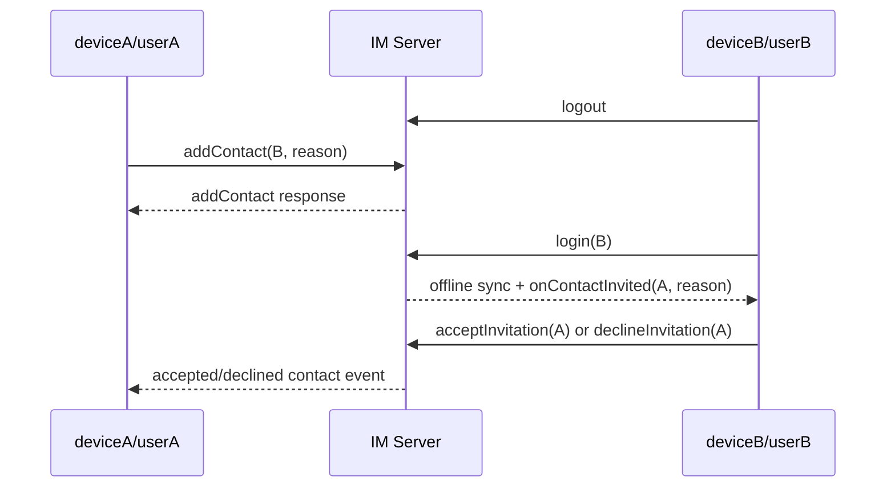
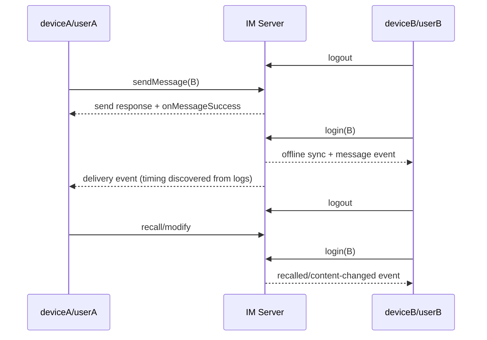

# 好友与单聊第一批离线 Cases 设计

## Overview

本批只补用户已确认的第一批 14 组离线业务场景，不修改发布 SDK、Android/iOS Wrapper 或测试 App 事件桥接。测试通过现有 WebSocket 通用桥接驱动两台模拟器：deviceA 默认登录 userA，deviceB 默认登录 userB；需要制造离线状态时显式 logout，业务操作完成后重新 login 并保留登录过程中进入 WebSocket 队列的事件。

持久化规范与任务状态仅维护在本 Kiro spec 中；Contact/Chat 模块台账继续作为独立覆盖报告。

## Architecture

```text
native-auto-test/tests/contact/test_contact_offline_friendship.py
    └── 好友申请、同意、拒绝及申请方离线反馈

native-auto-test/tests/chat/test_chat_offline_message_delivery.py
    └── 文本、媒体、CMD、online-only、多消息和送达回执

native-auto-test/tests/chat/test_chat_offline_message_operations.py
    └── 已读回执、撤回、修改的离线观察方链路

native-auto-test/src/test_flow/offline_test_flow.py
    └── logout/login、回调启动、事件保留、登录态恢复等跨模块最小编排
```

共享 helper 只负责会话生命周期和确定性的命令 envelope 断言，不封装业务预期。好友和消息事件仍在对应测试中直接对 `receive_message(...)` 的原始结果执行严格断言。

## Sequence Diagrams

### 离线好友申请



### 离线单聊消息及后续操作



## Component / Data / Workflow Design

### 1. 登录状态编排

- `logout_preserving_connection`：调用 `Client.logout(unbindToken=false)`，严格断言响应并清理退出前的陈旧事件。
- `login_preserving_events`：调用 `Client.login`，严格断言用户名结果；测试 App 已在登录成功后自动执行 `startCallback`，helper 可再显式调用一次，但登录后不得 drain，以免丢掉离线同步事件。
- `restore_default_users`：在 `finally` 中把 deviceA/deviceB 恢复为 userA/userB，并清理本 case 残留事件。
- 每个 case 在制造离线前清理事件，业务动作后只按目标 eventType 和本次动态业务 ID/内容筛选，避免共享环境事件串扰。

### 2. 好友关系前置与清理

- 离线好友申请 case 开始前删除双方可能存在的好友/黑名单关系。
- 接收方显式调用 `acceptInvitationAlways=false`，避免执行顺序改变邀请语义。
- 消息类 case 使用现有 `ContactTestFlow` 在线建立好友关系，确认双方列表后再让 B 离线。
- `finally` 恢复登录并删除好友/黑名单状态；清理失败不得覆盖原始测试失败。

### 3. 消息构造

- 文本与多消息复用现有 `build_text` 结构。
- file/image/video/voice 使用 `sendMessageWithType` 和测试 App 内置素材，不传宿主机路径。
- CMD 明确传递 `deliverOnlineOnly=false`；online-only 负向场景显式传 `true`。
- 每条消息先从 `onMessageSuccess` 获取服务端真实 msgId，再用该 ID 关联接收、送达、已读、撤回和修改事件。

### 4. 事件与状态断言

- Contact：`type/eventType/data.userId/data.reason`，以及双方服务端好友列表。
- 普通消息：`msgId/from/to/convId/chatType/direction/status/read/delivery/body`。
- CMD：使用 `onCmdMessagesReceived`，不假设其未读和送达行为与普通消息相同。
- 已读：`onMessagesRead` 中目标消息的 read/delivery 状态。
- 撤回：`onMessagesRecalledInfo.infos` 中 recallBy、recallMsgId、convId、原消息和 ext，并关联同一 msgId 的 `onMessagesRecalled.messages`。
- 修改：`onMessageContentChanged` 中 message、operatorId、operationTime/attributes 的稳定字段。
- online-only：使用唯一内容或 action、事件等待和本地/服务端查询形成负向证据；不以一次极短 timeout 单独证明未投递。

## Constraints / Tradeoffs

- 两台模拟器通过 logout/login 复用账号，不引入第三台设备。
- 登录期间 SDK 事件可能早于 login 响应进入队列，因此不能在 login 后 drain。
- 离线同步 start/finish 是辅助证据，业务事件和最终状态是主断言；不预设二者顺序。
- 第一批媒体只覆盖 file/image/video/voice；location/custom/combine 留在后续类型扩展，避免首批范围继续膨胀。
- 好友信息自动同步依赖 `enableAutoSyncContacts=true`，不属于本批 14 组。
- 真实环境若出现 SDK/服务端缺失事件，保留严格失败或 deferred 记录，不修改 SDK 契约。

## Error Handling

- 所有会改变登录态、好友关系或 option 的测试使用 `try/finally` 恢复。
- helper 的恢复操作采用尽力清理并保留原始异常；测试主体不吞掉业务错误。
- discovery 发现错误时冻结明确 `code/description`；不接受 `result is not None`、多分支成功或错误兼容断言。
- 负向事件检查必须使用独立等待窗口，并结合最终列表/未读/消息查询，降低异步延迟造成的误判。

## Testing Strategy

1. 运行 `pytest --collect-only` 和 `python -m py_compile`，先确认命名、fixture 与导入。
2. 分别执行 `CASES_DISCOVER=1 WS_DEBUG=1 pytest -q tests/contact/test_contact_offline_friendship.py -s`、`tests/chat/test_chat_offline_message_delivery.py -s` 和 `tests/chat/test_chat_offline_message_operations.py -s`，同时使用 ADB logcat 保存两台设备日志。
3. 从真实响应中冻结稳定业务字段并缩小 `ignore_keys`。
4. 关闭 discovery，逐 case strict；不通过时回到日志诊断，而不是放宽断言。
5. 运行三个新增文件 strict 回归。
6. 更新 Contact/Chat 模块 record 或 deferred 台账。
7. 执行 `im_flutter_sdk/scripts/speckit.sh check`；本批不修改 Flutter/SDK，除非 discovery 暴露既有桥接缺口，否则不触发发布 SDK 构建。
