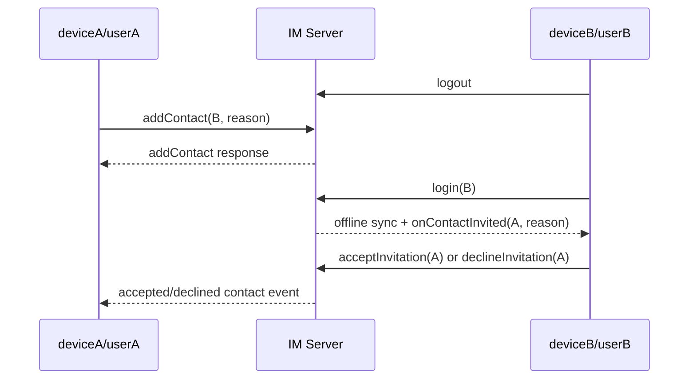
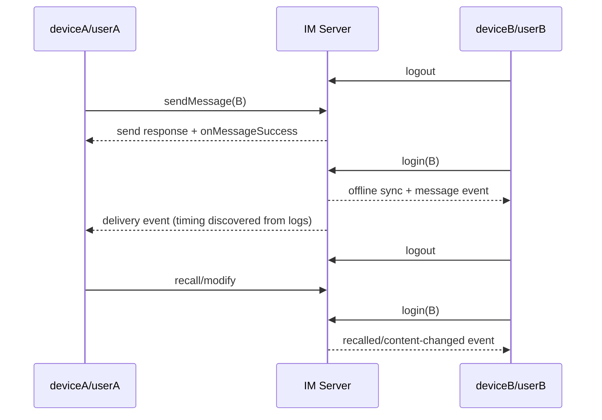

# 好友与单聊离线 Cases 设计

## Overview

本 spec 覆盖用户已确认的好友与单聊离线业务场景。第一批 17 个 pytest items 和第二批 10 个 P0 items 已完成；当前第三批以能力全覆盖而不是消息类型与操作的笛卡尔积，补齐首次投递前撤回/修改、非文本操作回调、离线自动翻译、媒体下载和积压后本地一致性。实现不修改发布 SDK、Android/iOS Wrapper 或测试 App 事件桥接。测试通过现有 WebSocket 通用桥接驱动两台模拟器：deviceA 默认登录 userA，deviceB 默认登录 userB；需要制造离线状态时显式 logout，业务操作完成后重新 login 并保留登录过程中进入 WebSocket 队列的事件。用户明确排除 App 强制停止和网络断开两种真实离线方式，本批仍以 SDK 登出/重新登录构造可重复的离线窗口。

持久化规范与任务状态仅维护在本 Kiro spec 中；Contact/Chat 模块台账继续作为独立覆盖报告。

## Architecture

```text
native-auto-test/tests/contact/test_contact_offline_friendship.py
    └── 好友申请、同意、拒绝、申请方离线反馈及双向好友删除

native-auto-test/tests/chat/test_chat_offline_message_delivery.py
    └── 文本、媒体、location、custom、combine、CMD、online-only、多消息和送达回执

native-auto-test/tests/chat/test_chat_offline_message_operations.py
    └── 单条/会话已读、撤回、修改、Reaction 与消息置顶的离线观察方链路

native-auto-test/tests/chat/test_chat_offline_message_extended_delivery.py
    └── 类型化送达回执、离线自动翻译、离线媒体下载和混合积压后的本地一致性

native-auto-test/tests/chat/test_chat_offline_message_extended_operations.py
    └── 首次投递前撤回/修改，以及非文本已读、撤回和修改的离线观察方链路

native-auto-test/src/test_flow/offline_test_flow.py
    └── logout/login、回调启动、事件保留、登录态恢复等跨模块最小编排
```

共享 helper 只负责会话生命周期和确定性的命令 envelope 断言，不封装业务预期。好友和消息事件仍在对应测试中直接对 `receive_message(...)` 的原始结果执行严格断言。

## Sequence Diagrams

### 离线好友申请



### 离线单聊消息及后续操作



## Component / Data / Workflow Design

### 1. 登录状态编排

- `logout_preserving_connection`：调用 `Client.logout(unbindToken=false)`，严格断言响应并清理退出前的陈旧事件。
- `login_preserving_events`：调用 `Client.login`，严格断言用户名结果；测试 App 已在登录成功后自动执行 `startCallback`，helper 可再显式调用一次，但登录后不得 drain，以免丢掉离线同步事件。
- `restore_default_users`：在 `finally` 中把 deviceA/deviceB 恢复为 userA/userB，并清理本 case 残留事件。
- 每个 case 在制造离线前清理事件，业务动作后只按目标 eventType 和本次动态业务 ID/内容筛选，避免共享环境事件串扰。

### 2. 好友关系前置与清理

- 离线好友申请 case 开始前删除双方可能存在的好友/黑名单关系。
- 接收方显式调用 `acceptInvitationAlways=false`，避免执行顺序改变邀请语义。
- 消息类 case 使用现有 `ContactTestFlow` 在线建立好友关系，确认双方列表后再让 B 离线。
- `finally` 恢复登录并删除好友/黑名单状态；清理失败不得覆盖原始测试失败。

### 3. 消息构造

- 文本与多消息复用现有 `build_text` 结构。
- file/image/video/voice 使用 `sendMessageWithType` 和测试 App 内置素材，不传宿主机路径。
- CMD 明确传递 `deliverOnlineOnly=false`；online-only 负向场景显式传 `true`。
- location 传递唯一地址/建筑物名称及固定经纬度；custom 传递唯一事件名和稳定参数。
- combine 先在线发送两条源消息并取得服务端真实 msgId，再让 B 离线并通过这两个真实 ID 构造合并消息。
- 每条消息先从 `onMessageSuccess` 获取服务端真实 msgId，再用该 ID 关联接收、送达、已读、撤回和修改事件。

### 4. 事件与状态断言

- Contact：`type/eventType/data.userId/data.reason`，以及双方服务端好友列表。
- 普通消息：`msgId/from/to/convId/chatType/direction/status/read/delivery/body`。
- CMD：使用 `onCmdMessagesReceived`，不假设其未读和送达行为与普通消息相同。
- 已读：`onMessagesRead` 中目标消息的 read/delivery 状态。
- 撤回：`onMessagesRecalledInfo.infos` 中 recallBy、recallMsgId、convId、原消息和 ext，并关联同一 msgId 的 `onMessagesRecalled.messages`。
- 修改：`onMessageContentChanged` 中 message、operatorId、operationTime/attributes 的稳定字段。
- 好友删除：重新登录观察方收到的 `onContactDeleted.data.userId`，以及双方服务端好友列表。
- 会话已读：只接受 discovery 证明的 `onConversationRead`，直接断言 `from/to`。
- Reaction：直接断言 `onMessageReactionDidChange.data.events` 中目标消息的 operation/reactions 结构，并通过 `fetchReactionList` 验证最终状态。
- 消息置顶：直接断言 `onMessagePinChanged` 的 messageId、conversationId、pinOperation、operatorId；通过 `fetchPinnedMessages` 验证最终状态。
- online-only：使用唯一内容或 action、事件等待和本地/服务端查询形成负向证据；不以一次极短 timeout 单独证明未投递。

### 5. 第三批能力全覆盖

- 不做“所有消息类型 × 所有 API”的无差别笛卡尔积，只覆盖 payload、事件或最终状态有区别的有效组合。
- 发送后首次上线前的撤回/修改使用文本消息：该场景的差异来自服务端离线队列与状态合并，而非 body 序列化。
- 类型化送达和已读覆盖 file、image、video、voice、location、custom、combine；CMD 的 delivery receipt 仍无稳定真实事件，保持 deferred。
- 类型化撤回覆盖 file、image、video、voice、location、custom、combine；每种类型从真实 `onMessagesRecalledInfo` 中冻结稳定 body 字段，媒体路径、secret、时间等仅作最小忽略。
- 内容修改覆盖 custom 的 body 修改，以及 file/image/video/voice 的 ext 修改；combine 不纳入修改矩阵，除非 discovery 证明 SDK 支持该类型。
- Reaction 和 pin/unpin 的离线回放事件不携带消息 body，现有文本 case 已覆盖其全部独立契约，因此不按类型重复。
- 自动翻译只覆盖发送时 `targetLanguages` 的离线同步结果；显式翻译接口尚无非空成功契约，保持 deferred。
- 附件下载只覆盖能在接收端下载的 file/image/video/voice；image/video 追加缩略图。每次下载使用 B 离线同步事件里的原始 message，不用人工拼装消息对象。
- 混合积压使用 text/location/custom/combine 四种代表性 body；事件采用 ID 集合断言，不固定网络或同步回调顺序，再用 `getMessage`、历史查询、未读和最新消息确认最终状态。

## Constraints / Tradeoffs

- 两台模拟器通过 logout/login 复用账号，不引入第三台设备。
- 登录期间 SDK 事件可能早于 login 响应进入队列，因此不能在 login 后 drain。
- 离线同步 start/finish 是辅助证据，业务事件和最终状态是主断言；不预设二者顺序。
- 第一批媒体覆盖 file/image/video/voice；第二批 P0 在同一投递模块补齐 location/custom/combine。
- 好友信息自动同步依赖 `enableAutoSyncContacts=true`，已按用户要求暂缓，不属于当前 P0 实现范围。
- 第二批不抽取或重构既有 helper，避免扩大对第一批 17 个已通过 items 的影响；新能力沿用现有三个离线模块。
- 第三批为避免继续膨胀超过千行的后操作文件，新建两个按责任拆分的离线扩展测试文件；它们可复用已有确定性 helper，但各业务 event 的 raw assertion 保留在新文件中。
- 用户明确排除 App 强制停止和网络断开两种端侧离线方式；本批离线仍使用 SDK logout/login 复用两台模拟器。
- 真实环境若出现 SDK/服务端缺失事件，保留严格失败或 deferred 记录，不修改 SDK 契约。

## Error Handling

- 所有会改变登录态、好友关系或 option 的测试使用 `try/finally` 恢复。
- helper 的恢复操作采用尽力清理并保留原始异常；测试主体不吞掉业务错误。
- discovery 发现错误时冻结明确 `code/description`；不接受 `result is not None`、多分支成功或错误兼容断言。
- 负向事件检查必须使用独立等待窗口，并结合最终列表/未读/消息查询，降低异步延迟造成的误判。

## Testing Strategy

1. 运行 `pytest --collect-only` 和 `python -m py_compile`，先确认命名、fixture 与导入。
2. 分别对新增 P0 test node 执行 `CASES_DISCOVER=1 WS_DEBUG=1 pytest -q ... -s`，同时使用 ADB logcat 保存两台设备日志，避免一次全量运行掩盖单场景事件时序。
3. 从真实响应中冻结稳定业务字段并缩小 `ignore_keys`。
4. 关闭 discovery，逐 case strict；不通过时回到日志诊断，而不是放宽断言。
5. 运行三个离线文件 strict 回归，确认第一批 17 items 未回归且第二批 10 items 全部通过。
6. 更新 Contact/Chat 模块 record 或 deferred 台账。
7. 执行 `im_flutter_sdk/scripts/speckit.sh check`；本批不修改 Flutter/SDK，除非 discovery 暴露既有桥接缺口，否则不触发发布 SDK 构建。
8. 第三批以每个扩展 node 的 discovery/strict 为准；只有确认所有矩阵能力可稳定派发时才写入 RECORD，服务端或桥接缺口仍保留 DEFERRED。
