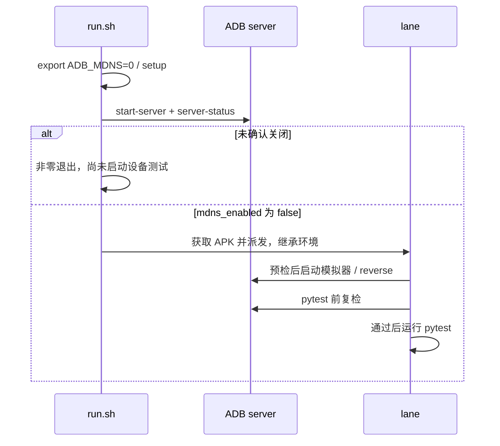
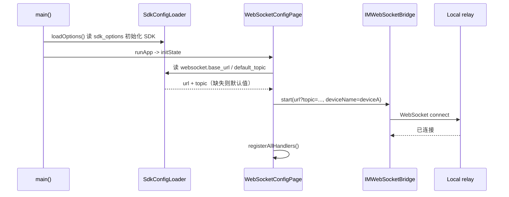
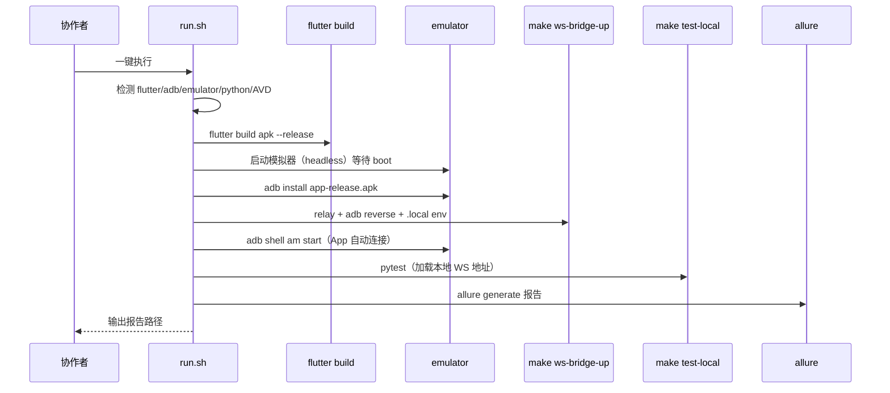
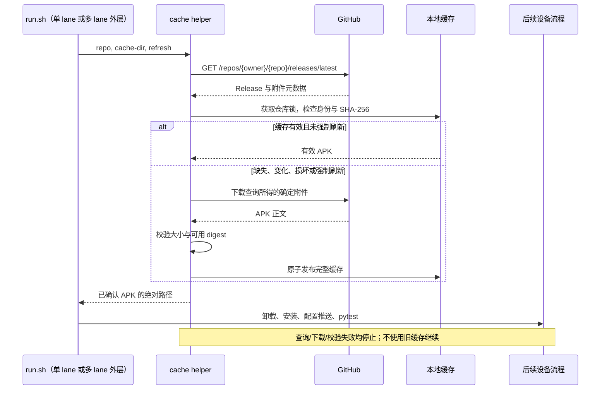

# release APK 测试自动化设计

## ADB mDNS 崩溃防护增量设计

### Overview

将已验证的 `ADB_MDNS=0` 固化到 skill。环境变量无法改变已运行的 server，因此采用“强制禁用 + 真实状态验证，无法确认则停止”，而非仅锁定版本或由各 lane 自动重启共享 ADB。

### Architecture / Component and workflow design

- `run.sh` 在 setup 和派发 lane 之前强制导出 `ADB_MDNS=0`。复用同一 SDK 解析函数，setup 后选择 adb，让新机器先安装工具再预检。
- 新增 skill 内 `scripts/adb_preflight.py`，仅用 Python 标准库，以所选 adb 路径执行 `start-server` 和 `server-status`。`--check-only` 用于 pytest 前只查询状态；每次调用 10 秒超时，子进程强制禁用 mDNS。
- 只接受成功响应中的唯一 `mdns_enabled: false`，不打印完整状态或 stderr。开启时打印正确 shell 引用的同路径重启命令；缺字段时提示使用支持状态检查的 platform-tools，不猜测旧版本行为。
- 多 lane 外层 setup 后、获取 APK 前预检；子 lane 同样预检，无跳过标记。pytest 前在 `set +e` 之前复检，失败由既有 EXIT trap 清理该 lane。所有路径均不调用 `kill-server`。

### Sequence diagrams



### Constraints / tradeoffs

- 只改 skill、工具测试与本 spec，不改 SDK、测试 App、业务用例或系统全局配置。
- 已存在的不安全 server 主动阻断；人工重启前需确认没有其他 ADB 任务，防止打断共享连接。
- 关闭无线调试自动发现，保留模拟器和 USB 通路。未知/旧版状态不放行。
- 外部工具在测试期间替换/强杀 server、其他崩溃、网络断开及自动恢复不在本增量保证范围内。

### Testing strategy

扩展真实 runner + 临时目录/fake 工具测试，区分 server 已有状态与客户端环境。验证启动顺序、状态门禁、环境传播、超时、失败时无 APK 安装/pytest/kill-server，以及 pytest 前漂移。保留缓存、分片、参数与清理回归；执行 shell 语法、skill 校验、speckit 与 diff 检查。当前本机 ADB 已禁用 mDNS，可直接运行预检 helper 做只读验收，不执行业务 E2E。

> 原始设计保留为历史阶段记录。当前 APK 获取流程以「Release APK 缓存增量设计」为准；ADB 防护以文首同名增量设计为准。下方双 APK、编译期设备标识和配置修改需重建等旧方案不作为当前增量实现依据。

## Overview

让 `im_flutter_test` 能以 release 模式稳定构建运行，并在启动时自动连接 WebSocket 桥接，消除手动 UI 操作；同时提供一个 repo-local skill 把「构建 → 模拟器 → 安装 → 桥接 → pytest → 报告」串成一条命令，降低团队上手门槛。

方案 A（选定）：`config.yaml` 继续打包进 APK asset，改 `sdk_options`/`websocket` 后需重新构建 APK；`rest_api`/`topics` 由 Python 侧运行时读取，不重建。skill 内包含构建步骤。运行时读取外部文件（方案 B）留待出现多环境痛点时再做。

## Architecture

### 1. release 构建支持（已完成）

- `im_flutter_test/android/app/proguard-rules.pro`
  - 新增 `-dontwarn` 忽略厂商推送（OPPO/魅族/vivo/小米）可选依赖的缺失类。
  - 新增 `-keep class com.hyphenate.**` 与 `-keep class internal.com.getkeepsafe.relinker.**`：环信 jar 未自带 consumer rules，其原生库按类名 JNI 查找 `com.hyphenate.chat.adapter.**` 等类，混淆会触发 `ClassNotFoundException`。
- `im_flutter_test/android/app/build.gradle`
  - release buildType 增加 `proguardFiles ... 'proguard-rules.pro'`。

### 2. App 自动连接（双端）

- `im_flutter_test/lib/sdk_config_loader.dart`
  - 复用现有 `rootBundle.loadString('assets/config.yaml')` 读取方式，新增读取 `websocket` 节的方法（返回 `base_url`、`default_topic`），缺失时回退默认值。
  - 新增按设备读取 topic 的方法：`topics[device]`，缺失回退 `default_topic`。
- `im_flutter_test/lib/websocket_config_page.dart`
  - 设备标识通过编译期常量 `String.fromEnvironment('DEVICE', defaultValue: 'deviceA')` 确定。
  - `initState` 异步读取 websocket 配置，按设备解析 topic，填充 controller，并自动调用 `_connect()`。
  - 保留手动「连接/断开」按钮与日志列表，用于诊断与手动切换。
- 默认值常量 `kDefaultBridgeWebSocketBaseUrl` / `kDefaultBridgeWebSocketTopic` 保持不变，作为回退来源。
- 双端通过构建两个 APK 实现：`--dart-define=DEVICE=deviceA` 与 `--dart-define=DEVICE=deviceB`，分别安装到两台模拟器。

### 3. 一键 skill

- `native-auto-test/skills/im-flutter-run/`
  - `SKILL.md`：使用说明、最小依赖（无需 Android Studio）、配置生效规则。
  - `scripts/run.sh`：环境检测 → 构建两个 release APK（deviceA/deviceB）→ 启动两台模拟器 → 分别安装 → 复用 `make ws-bridge-up`（relay + reverse）→ 复用 `make test-local`（pytest）→ `allure generate` 出报告。
- 复用现有组件，不重复实现：
  - relay/reverse/env：`make ws-bridge-up` → `scripts/ws_bridge_local.sh` + `scripts/adb_reverse_ws_bridge.sh`
  - pytest：`make test-local`（加载 `.local/ws-bridge.env`）
  - 报告：`allure generate out/allure-results -o out/allure-report --clean`

## Sequence Diagrams

### 自动连接（App 启动）



### 一键 skill 流程



## Component and Data Design

### websocket 配置读取

`sdk_config_loader.dart` 新增方法（示意）：

```dart
static Future<WebSocketConfig> loadWebSocketConfig() async {
  final content = await rootBundle.loadString('assets/config.yaml');
  final yaml = loadYaml(content) as YamlMap;
  final ws = yaml['websocket'] as YamlMap?;
  final baseUrl = ws?['base_url']?.toString().trim();
  final topic = ws?['default_topic']?.toString().trim();
  return WebSocketConfig(
    baseUrl: (baseUrl == null || baseUrl.isEmpty)
        ? kDefaultBridgeWebSocketBaseUrl
        : baseUrl,
    topic: (topic == null || topic.isEmpty)
        ? kDefaultBridgeWebSocketTopic
        : topic,
  );
}
```

`websocket_config_page.dart` 的 `initState` 变为异步初始化：先填充 controller，再触发一次 `_connect()`。`_connect()` 复用现有逻辑（`IMWebSocketBridge.instance.start` + `EventBridgeHandler.instance.registerAllHandlers()`），连接失败时沿用现有 SnackBar 提示，不阻塞 UI。

### skill 脚本职责与边界

`run.sh` 只做编排，具体命令复用现有 Makefile target：

| 步骤 | 复用/新增 |
|---|---|
| 环境检测 | 新增（command -v 检查 + AVD 列表） |
| 构建 release APK | 新增 `cd im_flutter_test && flutter build apk --release` |
| 启动模拟器 | 新增（`emulator -avd <avd> -no-window -no-audio -no-boot-anim -gpu swiftshader_indirect -no-snapshot`） |
| 安装 + 启动 App | 新增 `adb install` + `adb shell am start` |
| relay + reverse | 复用 `make ws-bridge-up` |
| pytest | 复用 `make test-local ARGS=...` |
| 报告 | 新增 `allure generate` |

skill 不自动修改 `config.yaml`、REST 配置或业务账号；不改写现有 relay 的 PID/env 状态文件语义。

## Constraints and Tradeoffs

- 只改 `im_flutter_test` 与 `native-auto-test`，不触碰 `im_flutter_sdk` 发布层与 iOS。
- 方案 A：config.yaml 打包进 APK，改 `sdk_options`/`websocket`/`topics` 需重建 APK。代价是 APK 不通用；收益是改动小、链路简单。运行时读取（方案 B）留作后续。
- 双端通过 `--dart-define=DEVICE=...` 构建两个 APK，代价是构建两次（release 增量构建快）；收益是无需改原生层读 intent、一个代码库覆盖双端。
- `-keep class com.hyphenate.**` 放弃对环信 SDK 的混淆优化（包体积略增），换取 JNI/反射/序列化稳定性；对测试 App 可接受。
- skill 首期不处理「无人值守重启模拟器失败重试」「多套环境并行」，聚焦双端一键跑通。
- 不引入新生产依赖；skill 仅依赖已有的 flutter/adb/emulator/python/allure。

## Testing Strategy

1. 对 `sdk_config_loader.dart` 的 websocket 配置读取与回退逻辑编写 Dart 单元测试（复用现有 `test/` 目录模式），覆盖：正常值、缺失节、空字符串回退。
2. 对自动连接触发逻辑做静态验证与模拟器冒烟：启动 relay 后装 release APK，无需手动操作，pytest 能收到 App 的连接并完成一次 `api.call`。
3. release 构建与 SDK 初始化：`flutter build apk --release` 成功后，logcat 验证 `hyphenate SDK is initialized`、无 `ClassNotFoundException`/`FATAL`。
4. skill：在本地完整执行 `run.sh`，验证一键走完「构建→模拟器→安装→桥接→pytest→报告」；再验证缺失 flutter/adb 时快速失败并给出提示。
5. 回归：确认现有 `make ws-bridge-up/down/test-local` 行为不变；`tests/tools` 无设备测试仍通过。
6. 手工验收项：release 构建、模拟器端到端、skill 一键流程（需显式 Android 环境）。

## Release APK 缓存增量设计

### Overview

采用「每次查询 Release 元数据 + 附件身份缓存 + 本地完整性校验」，而不是仅检查文件存在或每次下载完整 APK。查询失败立即停止，不自动回退旧 SDK。只改变 APK 获取步骤，设备卸载重装保持原样。

本节覆盖 requirements.md 的 C1–C13，是本次增量设计的权威来源。当前实际流程已经是单 APK、intent 设备注入、运行时配置推送和多 lane 编排。

### Architecture

- `native-auto-test/skills/im-flutter-run/scripts/run.sh`：解析 `--refresh-apk`，在环境准备前校验来源参数互斥；单/多 lane 的远端路径调用同一个缓存 helper，其他步骤保持不变。
- 新增同目录 `release_apk_cache.py`：使用现有 Python 标准库处理 GitHub 元数据、SHA-256、缓存锁及原子发布，调用已有 curl 下载以保留代理支持和进度反馈，不新增生产依赖。
- helper 命令接口：`--repo OWNER/REPO --cache-dir PATH [--refresh]`；成功 stdout 仅输出绝对 APK 路径，诊断与 curl 进度写 stderr；失败非零退出。Python 解释器使用 `run.sh` 已准备的 `$PY`。
- `native-auto-test/tests/tools/test_release_apk_cache.py`：测试 helper 与缓存行为。
- `native-auto-test/tests/tools/test_im_flutter_run_apk.py`：通过 stub 工具测试 run.sh 单/多 lane 获取包的编排，不启动真实模拟器或执行真实业务测试。
- 缓存根目录：`native-auto-test/.local/apk-cache/`，沿用本地忽略目录；不提交 APK 或元数据。

### Sequence diagrams



### Component / data / workflow design

#### 来源与参数

- 无本地来源参数：远端模式，每次在线查询。
- `--refresh-apk`：仅适用于远端模式，绕过缓存命中判断，不跳过元数据查询。
- `--build`：本地构建，不写入远端缓存。
- `APK_PATH`：显式非空时必须指向可读非空普通文件，使用既有包且不写入远端缓存。与 `--build` 或 `--refresh-apk` 冲突时立即报错。
- 多 lane 外层先获得一个确定的 APK，再通过 `APK_PATH` 传给各 lane；不向子 lane 转发 `--refresh-apk`/`--build`，从而不会重复刷新或触发冲突。
- 保留现有按 lane 复制到临时安装路径的步骤；源和目标为同一文件时跳过复制，避免 `cp` 自复制失败。

#### 远端查询与版本识别

- 严格校验 repo 为 `OWNER/REPO` 形状且不含路径穿越，不把未经校验的输入拼成缓存路径。
- 使用 `https://api.github.com/repos/{owner}/{repo}/releases/latest`；JSON Accept 头与 GitHub API 版本头固定。优先读取 GH_TOKEN，其次 GITHUB_TOKEN；无 token 时匿名。认证头用 curl `--header @-` 从 stdin 读取，拒绝控制字符。curl 子进程环境移除两个 token 变量，下载子进程同样移除；不创建认证文件。
- 查询超时设为 60 秒；APK 下载沿用 600 秒上限。任何非成功 HTTP 响应或 JSON/必需字段错误均失败。限流提示稍后重试，不自动回退。
- 唯一选择 name=`app-release.apk` 且 state=`uploaded` 的附件，读取 release id/tag、asset id/updated_at/size/browser_download_url/digest；id 和 size 必须为正整数。
- 下载使用该附件返回的 HTTPS `browser_download_url`，限定为所选 GitHub 仓库的明确 tag 下载地址；拒绝 latest 路径。若查询后附件被替换且旧地址返回新内容，大小和远端 digest（若有）提供校验；没有 digest 时不声称具备远端密码学身份保证。
- 缓存身份由规范化 repo、release id、asset id、updated_at、size、digest 构成；tag 及下载地址写入元数据用于追溯。digest 缺失允许继续；提供时只接受合法 `sha256:<hex>`，不静默忽略非法 digest。

#### 缓存结构与完整性

```text
.local/apk-cache/<owner>/<repo>/
  .lock
  <identity-sha256>/
    current
    <content-sha256>/
      app-release.apk
      metadata.json
```

- identity-sha256 是稳定序列化身份字段的 SHA-256；content-sha256 是完整 APK 的 SHA-256。`current` 记录最近一次成功选择的 content-sha256，完整 generation 发布后原子替换；命中只校验该 generation，不从历史目录任意选择，防止强制刷新后下次又使用旧内容。pointer 缺失或损坏视为缓存失效。
- metadata.json 包括 schema version、身份字段、tag、download URL、本地 size/sha256。缓存元数据只辅助校验，不能替代每次远端查询。
- 获取仓库级 `fcntl.flock` 排他锁，等待最多 60 秒，超时明确报错；适用于当前 macOS/Linux，不引入第三方锁依赖。获取锁后才检查缓存、下载和发布。
- 命中时检查 schema、身份字段、普通文件、实际大小和本地 SHA-256；有远端 digest 时还须与它一致。异常元数据视为缓存失效，重新下载。
- 临时目录放在相同缓存文件系统内，下载、校验、元数据写入完成后通过目录 rename 发布一个完整 generation。强制刷新得到相同内容时可以复用已验证的既有 generation；损坏 generation 在锁内隔离后替换，不允许半包成为有效路径。
- 已发布有效 generation 不原地改写，因此并发运行已经取得的路径不受刷新影响。失败只清理本次临时产物，保留原有效 generation；本次仍非零退出。
- 不自动淘汰历史 generation，避免删除并发测试正在使用的包；后续可单独设计缓存清理功能。

#### 日志与错误

- 日志应区分：查询远端、缓存命中、附件变化/首次下载/损坏重下、强制刷新、校验失败。
- 成功日志包含 repo、tag、asset id 与路径，方便知道实际测试的包；不输出完整 HTTP 响应、认证头或带签名重定向地址。
- 本地 I/O 或锁错误也应失败，不自动切换到临时无缓存下载。下载完成前不进入设备安装步骤。

### Constraints / tradeoffs

- 每次仍需一次轻量网络请求；支持可选环境变量认证降低匿名限流风险，不自动修改全局配置，不新增离线回退。
- API curl 通过 `--include` 捕获 HTTP 头与正文（不输出原始内容），解析最后一个 HTTP 响应。错误诊断仅允许状态码、纯数字 remaining/reset/retry-after 和认证模式；401 提示 token 无效，403/429 根据 remaining=0、429 或正文 rate-limit 分类，其余标为 HTTP 错误。curl 失败仅输出退出码/类别，不输出 stderr，避免敏感数据泄露。
- 每次复用读取约 57MB 本地文件计算 SHA-256，比只检查大小更可靠，但会增加少量本地 I/O。
- 在没有远端 digest 的情况下，本地 SHA-256 可检测后续缓存损坏，不等同于独立验证发布者身份。依赖 GitHub HTTPS 与确定附件元数据。
- 不对整个 run.sh 的临时路径、模拟器端口和报告目录并发安全作全面重构；本次并发保证只涵盖 APK 缓存。
- 保留当前卸载命令及错误处理，不改用 `install -r` 或 `uninstall -k`；卸载后包存在性检查属于后续独立加固，不在本次验收承诺内。
- 不修改 App、SDK、CI 发布、系统/全局配置或远端资源，不引入新生产依赖。

### Testing strategy

- helper 单元/集成测试使用临时目录、伪造元数据和注入/替身下载器，严格断言调用次数及下载 URL，不访问真实 GitHub。
- 覆盖首次下载、同身份命中、新 Release、同 tag 附件替换、更新时间/大小/digest 变化、跨 repo 隔离。
- 覆盖缺失/零字节/同大小内容损坏的 APK、无效 metadata、有效与不匹配 digest。
- 覆盖强制刷新（相同内容与不同内容）、API 失败/限流/非法 JSON/缺失附件/非法字段、下载超时/截断、发布失败；已有缓存时失败也必须退出，旧缓存不得被破坏。
- 用并发子进程测试锁下命中/下载，验证正常并发只下载一次，失败不发布半包；锁超时需有确定性测试。
- run.sh stub 测试覆盖单 lane、多 lane 外层一次查询/下载与子 lane 复用、`--refresh-apk` 传播、本地来源绕过 API、参数冲突及无效 APK_PATH。确认设备卸载仍先于安装，配置推送仍执行。
- 自动化验证命令与完成状态仅记录在 tasks.md。真实 GitHub/模拟器冒烟如后续获得授权再执行，不用真实业务用例替代缓存工具测试。
