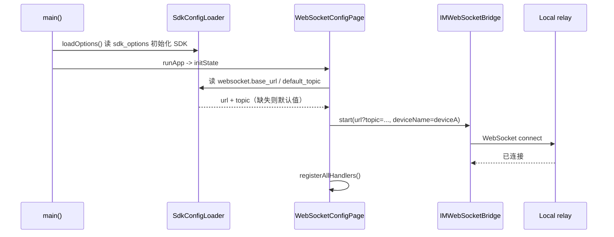
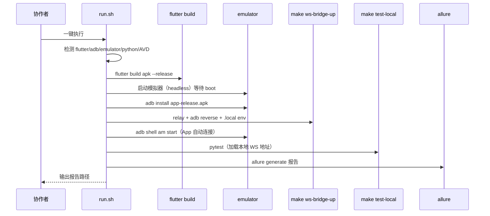

# release APK 测试自动化设计

## Overview

让 `im_flutter_test` 能以 release 模式稳定构建运行，并在启动时自动连接 WebSocket 桥接，消除手动 UI 操作；同时提供一个 repo-local skill 把「构建 → 模拟器 → 安装 → 桥接 → pytest → 报告」串成一条命令，降低团队上手门槛。

方案 A（选定）：`config.yaml` 继续打包进 APK asset，改 `sdk_options`/`websocket` 后需重新构建 APK；`rest_api`/`topics` 由 Python 侧运行时读取，不重建。skill 内包含构建步骤。运行时读取外部文件（方案 B）留待出现多环境痛点时再做。

## Architecture

### 1. release 构建支持（已完成）

- `im_flutter_test/android/app/proguard-rules.pro`
  - 新增 `-dontwarn` 忽略厂商推送（OPPO/魅族/vivo/小米）可选依赖的缺失类。
  - 新增 `-keep class com.hyphenate.**` 与 `-keep class internal.com.getkeepsafe.relinker.**`：环信 jar 未自带 consumer rules，其原生库按类名 JNI 查找 `com.hyphenate.chat.adapter.**` 等类，混淆会触发 `ClassNotFoundException`。
- `im_flutter_test/android/app/build.gradle`
  - release buildType 增加 `proguardFiles ... 'proguard-rules.pro'`。

### 2. App 自动连接（双端）

- `im_flutter_test/lib/sdk_config_loader.dart`
  - 复用现有 `rootBundle.loadString('assets/config.yaml')` 读取方式，新增读取 `websocket` 节的方法（返回 `base_url`、`default_topic`），缺失时回退默认值。
  - 新增按设备读取 topic 的方法：`topics[device]`，缺失回退 `default_topic`。
- `im_flutter_test/lib/websocket_config_page.dart`
  - 设备标识通过编译期常量 `String.fromEnvironment('DEVICE', defaultValue: 'deviceA')` 确定。
  - `initState` 异步读取 websocket 配置，按设备解析 topic，填充 controller，并自动调用 `_connect()`。
  - 保留手动「连接/断开」按钮与日志列表，用于诊断与手动切换。
- 默认值常量 `kDefaultBridgeWebSocketBaseUrl` / `kDefaultBridgeWebSocketTopic` 保持不变，作为回退来源。
- 双端通过构建两个 APK 实现：`--dart-define=DEVICE=deviceA` 与 `--dart-define=DEVICE=deviceB`，分别安装到两台模拟器。

### 3. 一键 skill

- `native-auto-test/skills/im-flutter-run/`
  - `SKILL.md`：使用说明、最小依赖（无需 Android Studio）、配置生效规则。
  - `scripts/run.sh`：环境检测 → 构建两个 release APK（deviceA/deviceB）→ 启动两台模拟器 → 分别安装 → 复用 `make ws-bridge-up`（relay + reverse）→ 复用 `make test-local`（pytest）→ `allure generate` 出报告。
- 复用现有组件，不重复实现：
  - relay/reverse/env：`make ws-bridge-up` → `scripts/ws_bridge_local.sh` + `scripts/adb_reverse_ws_bridge.sh`
  - pytest：`make test-local`（加载 `.local/ws-bridge.env`）
  - 报告：`allure generate out/allure-results -o out/allure-report --clean`

## Sequence Diagrams

### 自动连接（App 启动）



### 一键 skill 流程



## Component and Data Design

### websocket 配置读取

`sdk_config_loader.dart` 新增方法（示意）：

```dart
static Future<WebSocketConfig> loadWebSocketConfig() async {
  final content = await rootBundle.loadString('assets/config.yaml');
  final yaml = loadYaml(content) as YamlMap;
  final ws = yaml['websocket'] as YamlMap?;
  final baseUrl = ws?['base_url']?.toString().trim();
  final topic = ws?['default_topic']?.toString().trim();
  return WebSocketConfig(
    baseUrl: (baseUrl == null || baseUrl.isEmpty)
        ? kDefaultBridgeWebSocketBaseUrl
        : baseUrl,
    topic: (topic == null || topic.isEmpty)
        ? kDefaultBridgeWebSocketTopic
        : topic,
  );
}
```

`websocket_config_page.dart` 的 `initState` 变为异步初始化：先填充 controller，再触发一次 `_connect()`。`_connect()` 复用现有逻辑（`IMWebSocketBridge.instance.start` + `EventBridgeHandler.instance.registerAllHandlers()`），连接失败时沿用现有 SnackBar 提示，不阻塞 UI。

### skill 脚本职责与边界

`run.sh` 只做编排，具体命令复用现有 Makefile target：

| 步骤 | 复用/新增 |
|---|---|
| 环境检测 | 新增（command -v 检查 + AVD 列表） |
| 构建 release APK | 新增 `cd im_flutter_test && flutter build apk --release` |
| 启动模拟器 | 新增（`emulator -avd <avd> -no-window -no-audio -no-boot-anim -gpu swiftshader_indirect -no-snapshot`） |
| 安装 + 启动 App | 新增 `adb install` + `adb shell am start` |
| relay + reverse | 复用 `make ws-bridge-up` |
| pytest | 复用 `make test-local ARGS=...` |
| 报告 | 新增 `allure generate` |

skill 不自动修改 `config.yaml`、REST 配置或业务账号；不改写现有 relay 的 PID/env 状态文件语义。

## Constraints and Tradeoffs

- 只改 `im_flutter_test` 与 `native-auto-test`，不触碰 `im_flutter_sdk` 发布层与 iOS。
- 方案 A：config.yaml 打包进 APK，改 `sdk_options`/`websocket`/`topics` 需重建 APK。代价是 APK 不通用；收益是改动小、链路简单。运行时读取（方案 B）留作后续。
- 双端通过 `--dart-define=DEVICE=...` 构建两个 APK，代价是构建两次（release 增量构建快）；收益是无需改原生层读 intent、一个代码库覆盖双端。
- `-keep class com.hyphenate.**` 放弃对环信 SDK 的混淆优化（包体积略增），换取 JNI/反射/序列化稳定性；对测试 App 可接受。
- skill 首期不处理「无人值守重启模拟器失败重试」「多套环境并行」，聚焦双端一键跑通。
- 不引入新生产依赖；skill 仅依赖已有的 flutter/adb/emulator/python/allure。

## Testing Strategy

1. 对 `sdk_config_loader.dart` 的 websocket 配置读取与回退逻辑编写 Dart 单元测试（复用现有 `test/` 目录模式），覆盖：正常值、缺失节、空字符串回退。
2. 对自动连接触发逻辑做静态验证与模拟器冒烟：启动 relay 后装 release APK，无需手动操作，pytest 能收到 App 的连接并完成一次 `api.call`。
3. release 构建与 SDK 初始化：`flutter build apk --release` 成功后，logcat 验证 `hyphenate SDK is initialized`、无 `ClassNotFoundException`/`FATAL`。
4. skill：在本地完整执行 `run.sh`，验证一键走完「构建→模拟器→安装→桥接→pytest→报告」；再验证缺失 flutter/adb 时快速失败并给出提示。
5. 回归：确认现有 `make ws-bridge-up/down/test-local` 行为不变；`tests/tools` 无设备测试仍通过。
6. 手工验收项：release 构建、模拟器端到端、skill 一键流程（需显式 Android 环境）。
