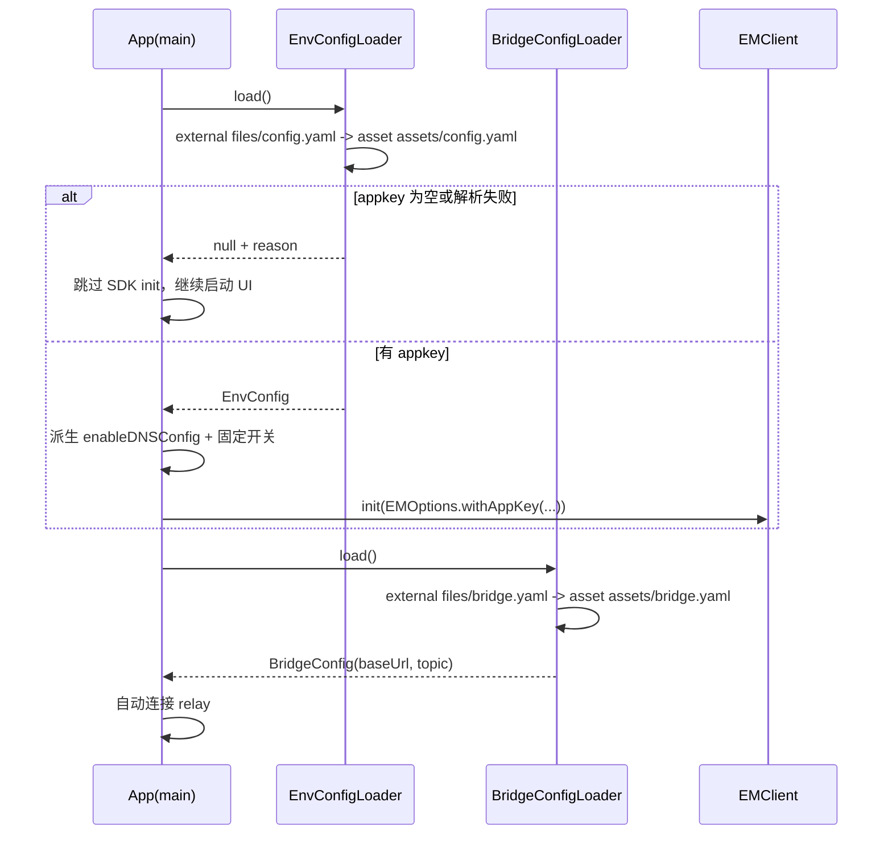
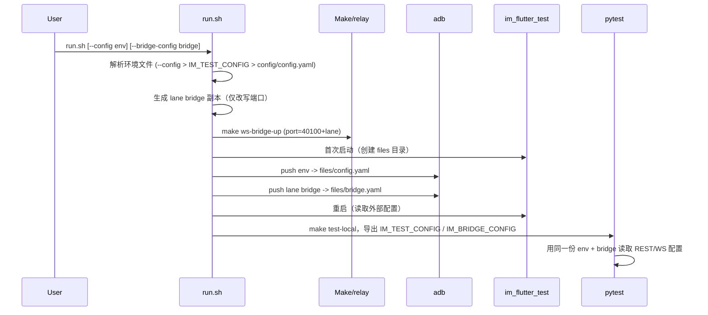
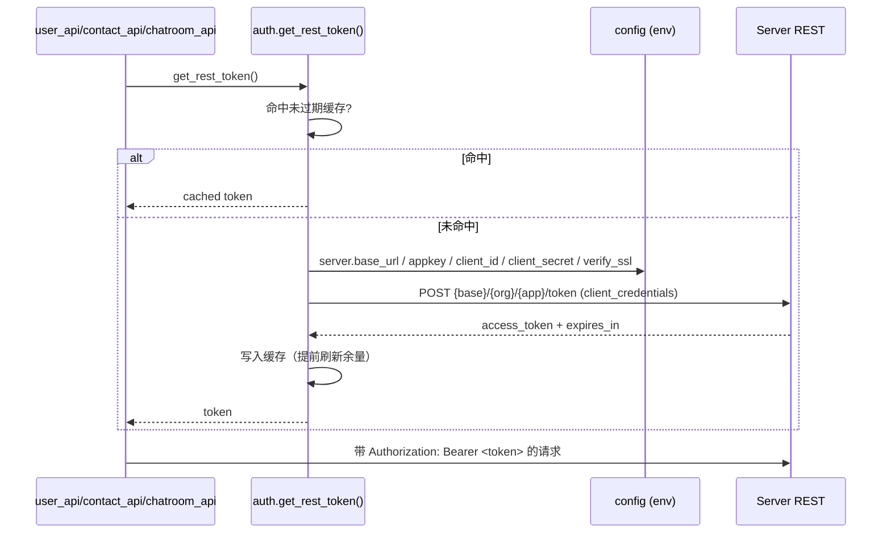

# 共享运行时配置设计

## Overview

把本仓库的环境配置从自有的 `websocket / topics / rest_api / sdk_options` 混合格式，迁移为与 `/Users/project/im-test-hub` 一致的单一 `app:` 根节点 schema。两个仓库各自保存一份文件，但格式相同、语义相同、可互相复制。

同时做三件收敛：

1. SDK 初始化中固定不变的开关（`autoLogin` 等 6 项）从配置下沉到 Dart 初始化代码，配置只描述环境。
2. `enable_dns_config` 不再作为字段，改由 `app.sdk.msync` 是否显式给出 tcp/websocket 主机推导，与 im-test-hub Python SDK 的既有语义一致。
3. 桥接运行态（relay 地址、topic）拆到独立的 `bridge.yaml`，与含凭据的环境文件分离；Python REST 凭据改为由 `server.client_id/client_secret` 动态换取，删除静态 `rest_api.auth_token`。

## Architecture

### 文件与职责

```
native-auto-test/
  config/
    env.yaml.template          # 提交：环境模板（app schema，仅占位值）
    bridge.yaml                # 提交：桥接默认配置（非敏感）
    config.yaml                # 本地：默认环境文件（gitignored）
    <env>.yaml                 # 本地：具名环境文件（gitignored）
  src/tools/config.py          # 环境/桥接文件解析 + 派生的 REST 凭据访问器
  src/rest_api/auth.py         # client_credentials token 获取与缓存
  skills/im-flutter-run/scripts/run.sh   # 选择/推送环境与桥接文件

im_flutter_test/
  assets/config.yaml           # 提交：无凭据占位环境文件（asset 回退）
  assets/bridge.yaml           # 符号链接 -> ../../native-auto-test/config/bridge.yaml（已提交，链接稳定）
  lib/env_config.dart          # 环境文件解析 + DNS 派生 + fixed options + EMOptions 映射
  lib/bridge_config.dart       # 桥接文件解析（外部 > asset）
  lib/sdk_config_loader.dart   # 保留为薄封装，转发到上面两个 loader（兼容现有调用点）
```

`.gitignore`（`native-auto-test`）新增：

```
config/*.yaml
!config/bridge.yaml
```

`config.yaml`（旧规则）与 `.local/` 保持不变。模板以 `.template` 结尾，不受影响。

### 环境 schema（`app:`）

键与 im-test-hub `e2e_scripts/e2e.config.template.yaml` 对齐；标注「本仓库扩展」的为可选附加字段。

```yaml
app:
  cluster: ebs                     # im-test-hub 环境条件判定用，本仓库透传
  appkey: "org#app"
  wait: 3
  console:                         # 可选透传，本仓库不消费
    url: ""                        # 例：https://console.easemob.com/user/login
    username: ""
    password: ""
  imm:                             # 可选透传，本仓库不消费
    url: ""
    username: ""
    password: ""
    cluster: ""
  server:
    base_url: "https://a1.easemob.com"   # 仅协议+主机，不含 /org/app
    client_id: ""
    client_secret: ""
    verify_ssl: true               # 本仓库扩展，可选，默认 true
  sdk:
    user_login_password: "1"
    rest_host: ""                  # 空则回退 server.base_url
    msync:
      protocol: websocket
      tcp_host: ""
      tcp_port: ""
      websocket_host: ""
      websocket_port: ""
      enable_lz4: "0"
      compress_algorimth: COMPRESS_ZLIB
      sync_delay: 0
  datasync:
    websocket_host: ""
    websocket_port: ""
    websocket_path: "/ws"
    use_ssl: "1"
  log:
    enable_file_log: "1"
    log_dir: log
```

### 桥接 schema（`bridge.yaml`）

```yaml
websocket:
  base_url: "ws://127.0.0.1:4000/iov/websocket/dual"
  default_topic: "adc"
  connect_timeout: 10
  response_timeout: 30
  debug:
    dump_events: false
    relax_event_match: false
    sniff_seconds: 15
topics:
  deviceA: adc
  deviceB: adc01
```

## Sequence Diagrams

### App 启动与 SDK 初始化



### run.sh 配置选择与推送



### Python REST token 获取与缓存



## Component and Data Design

### 文件解析与选择（Python：`src/tools/config.py`）

- `resolve_env_config_path()`：`--config`（由 run.sh 通过 `IM_TEST_CONFIG` 注入的路径，若存在）> `IM_TEST_CONFIG` > `<repo>/config/config.yaml`。使用 `Path.resolve()` 后检查存在性；全部不命中抛 `RuntimeError`。
  - 说明：Python 侧不直接解析 CLI `--config`，`run.sh`/make 负责把 CLI 结果写进 `IM_TEST_CONFIG`，Python 只读环境变量与默认路径，保持测试可注入。
- `resolve_bridge_config_path()`：`IM_BRIDGE_CONFIG` > `<repo>/config/bridge.yaml`；不命中抛 `RuntimeError`。
- `load_env_config()` / `load_bridge_config()`：解析并缓存（`functools.lru_cache` 或模块级缓存），非法 YAML 报明确错误。
- 删除 `get_sdk_options()` / `get_sdk_app_key()` / `get_rest_auth_token()` 及对旧键的读取。

派生访问器：

| 访问器 | 来源 | 缺失/空时行为 |
|---|---|---|
| `get_appkey()` | `app.appkey` | `""` |
| `get_server_base_url()` | `app.server.base_url`（去尾部 `/`） | `""` |
| `get_rest_base_url()` | `{server.base_url}/{org}/{app}` | 任一缺失返回 `""` |
| `get_client_id()` / `get_client_secret()` | `app.server.*` | `""` |
| `has_rest_credentials()` | 两个 client 字段均非空 | `False` |
| `get_rest_verify_ssl()` | `app.server.verify_ssl` | `True` |
| `get_ws_base_url()` | `WS_BASE_URL`（非空）> `bridge.websocket.base_url` | 保留现有默认 |
| `get_default_topic()` / `get_topic(device)` | `bridge.topics.<device>` > `bridge.websocket.default_topic` | 保留现有默认 |
| `get_connect_timeout()` / `get_response_timeout()` | `bridge.websocket.*` | 现有默认 10 / 30 |

### REST token（Python：`src/rest_api/auth.py`）

- `get_rest_token() -> str`：缓存命中且未过期返回；否则 `POST {rest_base}/token`，body `{"grant_type":"client_credentials","client_id":..., "client_secret":...}`。
- 缓存结构：`(token, expires_at_monotonic)`；`expires_in` 缺失时使用保守默认（如 3600s）；提前 60s 视为过期。
- 失败：抛 `RuntimeError`，消息包含 HTTP 状态码或传输错误类别，不含 token/secret 明文。
- `_authorization_header()`：token 非空时输出 `Bearer <token>`；此时 `user_api`/`contact_api`/`chatroom_api` 改为调用 `get_rest_token()`。
- 仅 client_credentials：`has_rest_credentials()` 供 `conftest` 判断是否走 REST 创建路径（无凭据时回退 WS `createAccount`）。
- 并发：单进程 pytest，不引入锁；缓存用简单模块变量。

### App 环境解析与映射（Dart：`lib/env_config.dart`）

- 读取优先级：外部 `config.yaml` > `assets/config.yaml`。
- 解析出 `EnvConfig`，暴露 `appkey`、`restServer`、`imServer`、`imPort`、`webSocketServer`、`webSocketPort`、`syncDataWebSocketServer`、`syncDataWebSocketPort`、`enableDNSConfig`。
- DNS 派生：`enableDNSConfig = !(_nonEmpty(msync.tcp_host) || _nonEmpty(msync.websocket_host))`。
- 空值处理：映射来源为空字符串时对应参数传 `null`；整数端口优先接受 `int`，否则 `int.tryParse`。
- `buildOptions()` 固定写入 6 个开关并调用 `EMOptions.withAppKey(...)`。
- 缺 appkey：`load()` 返回 `null` 并带原因字符串；`main()` 跳过 `init`，仍启动 UI。
- 外部目录归属：`MainActivity.onCreate` 调用 `getExternalFilesDir(null)` 确保 `files/` 由 App uid 创建。不得用 `adb shell mkdir` 以 shell 身份创建该目录，否则 App 无权限进入（`Permission denied`），注入配置读不到；`run.sh` 不再创建该目录。

### App 桥接解析（Dart：`lib/bridge_config.dart`）

- 读取优先级：外部 `bridge.yaml` > `assets/bridge.yaml`。
- 纯函数 `parse(content)`、`parseTopicForDevice(content, device)` 保留现有容错（非法 YAML / 空值 → null）。
- `SdkConfigLoader` 保留现有公开方法名，内部委托到新 loader，避免 `websocket_config_page.dart`/测试大面积改动；其中 `loadWebSocketConfig`/`loadTopicForDevice` 改读桥接文件，`loadOptions` 改读环境文件。

### run.sh 配置处理

- 新增参数：`--config <env.yaml>`、`--bridge-config <bridge.yaml>`。
- 解析并规范化绝对路径；未提供时按优先级回退；都缺失直接 `fail`。
- 多 lane 父进程解析一次，导出 `IM_TEST_CONFIG` / `IM_BRIDGE_CONFIG` 给子 lane。
- lane 桥接副本：`sed -E "s#(base_url:[[:space:]]*\"ws://127\.0\.0\.1:)[0-9]+#\1$WS_PORT#"`，输出到 `$WS_STATE_DIR/bridge.yaml`（或 `/tmp/im-flutter-run-bridge-lane$LANE.yaml`）。
- 推送到 `files/config.yaml` 与 `files/bridge.yaml`；两文件都先 `force-stop` 再 push，最后重启。
- `make test-local` 调用前导出 `IM_TEST_CONFIG`/`IM_BRIDGE_CONFIG`。

## Constraints and Tradeoffs

- **已知 schema 分歧点**：`server.verify_ssl` 与 `console` 是 im-test-hub 模板当前没有的字段。im-test-hub 解析器忽略未知键，因此文件仍可双向复制；但这是语义扩展，若对方团队后续加严格 schema 校验需同步。不使用独立 env 变量的原因是：按环境控制 TLS 校验属于环境属性，放环境文件更直观。
- **不接受的能力**：`enable_dns_config` 推导后无法表达"给了 msync 地址但仍走 DNS"；这是自相矛盾组合，判定为不需要。若未来出现真实需求，再以"显式字段优先"的加法处理。
- **不物理共用同一文件**：两个仓库各自保存副本，只保证 schema/语义一致；跨仓库同步靠人工复制与本文档 schema。若要强一致，后续可加 parity 校验脚本。
- **不修改发布层**：本功能只改 `im_flutter_test` 测试端与 `native-auto-test` 工具端，不触碰 `im_flutter_sdk` / `_android` / `_ios` / `_interface`。
- **凭据不入包**：`assets/config.yaml` 为无凭据占位；真实环境文件通过 adb 注入。`assets/bridge.yaml` 指向已提交的非敏感文件，链接不会像之前指向 gitignored 文件那样断链。
- **动态 token 的范围**：只服务本仓库 REST 用户/联系人/聊天室管理接口；不替换 WS 桥接本身，也不影响无凭据时的 WS `createAccount` 兜底。
- **外部目录归属**：Android 11+ 下 `/sdcard/Android/data/<pkg>/files/` 必须由 App 进程创建，shell 创建的同一路径 App 无权限访问。因此外部目录创建放在 `MainActivity.onCreate`，`run.sh` 只做 push；首次启动（SDK 因缺 appkey 跳过初始化）也必须能创建该目录。
- **兼容期**：不保留旧格式解析分支（不同时支持 `sdk_options` 与 `app`）。迁移一次性完成，旧本地 `config.yaml` 需要按模板改写；README 提供迁移步骤。
- **无静态 token**：REST 凭据只支持 client_credentials；缺少 `client_id/client_secret` 时 REST 不可用，测试降级为 WS `createAccount`。部分环境禁止开放注册（返回 401），此时必须配置 client 凭据。

## Testing Strategy

1. **Dart 纯函数测试**（不依赖设备/网络，`flutter test`）：
   - 固定开关：任意环境输入都得到 `autoLogin/debugMode/requireAck/requireDeliveryAck=true`、`enableAutoSyncContacts=false`、`enableUserInfo=true`。
   - DNS 派生：tcp_host 非空 / websocket_host 非空 / 两者都空 / 仅 rest_host / 仅 datasync 五种输入。
   - 地址映射：各字段正确落到对应 `EMOptions`；缺失与空字符串得到 `null`；端口整数与字符串均可解析，非法端口为 `null`。
   - 缺 `appkey` / 非法 YAML 时 `load()` 返回 `null` 且不抛异常。
   - 桥接解析：正常、缺失节、空值、非法 YAML、去空白、按 device 取 topic、回退 default_topic。
   - 读取优先级：外部文件优先于 asset（用可注入的读取函数或临时文件桩）。
2. **Python 单元测试**（`native-auto-test/tests/tools/`，不依赖设备/网络）：
   - 文件选择优先级：`IM_TEST_CONFIG` 覆盖默认；缺失时抛 `RuntimeError`；桥接同理。
   - 未知字段容错：用 im-test-hub 风格 YAML 副本（含 `cluster/imm/wait/him23003`）能正常读取 `app.*`。
   - REST base URL 派生：含/不含尾部 `/`、appkey 无 `#`、`server.base_url` 为空。
   - token：mock HTTP 返回 `access_token/expires_in`，验证缓存复用与到期刷新；失败路径验证异常消息无 secret 明文。
   - `verify_ssl`：`false` 走 unverified context，缺失默认走校验。
   - `WS_BASE_URL` 优先级保持：非空覆盖、空值回退、未设置回退。
3. **配置与脚本静态检查**：`bash -n` 校验 run.sh；用临时目录与假配置验证 `--config` 选择与 lane 桥接改写（不启模拟器）。
4. **构建/自检**：`cd im_flutter_test && flutter analyze && flutter test`；`cd native-auto-test && python -m compileall src tests && python -m pytest tests/tools -q`。
5. **端到端冒烟（需设备，列为手工验收）**：`run.sh --config config/<env>.yaml` 跑一个最小用例，确认 App 用注入配置初始化、DNS 派生正确、桥接连通、pytest REST 动态 token 可用。
