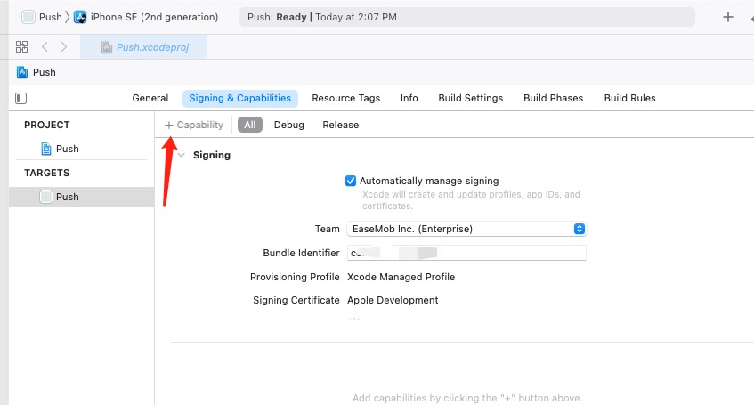
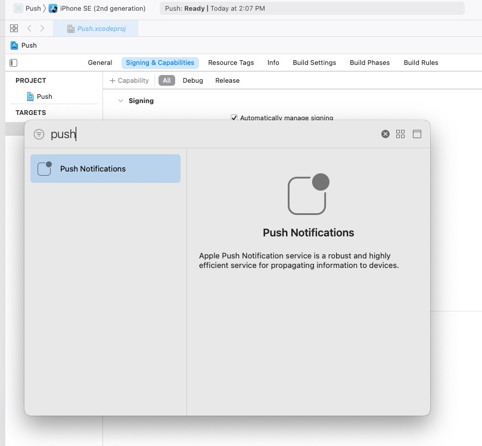
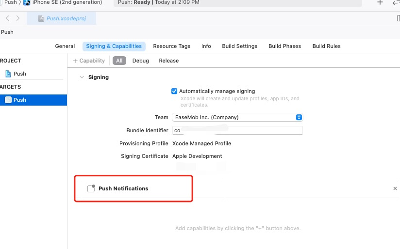

# 常见问题

### 如何开启推送

需要使用Xcode打开项目，并开启推送设置；





### 同时使用了其他推送是否会和环信SDK冲突？

目前已知在使用 [极光推送插件](https://github.com/jpush/jpush-flutter-plugin) 时获取DeviceToken时会出现冲突，环信提供了单独的Api供给应用来主动设置DeviceToken

```iOS
EMClient.getInstance.pushManager.updateAPNsDeviceToken("token");
```

### 更新依赖库导致的编译失败

iOS项目在更新时，会先通过cocoapods拉取依赖库，如果您当前的版本和拉取的版本不一致，会出现`Podfile.lock` 引起的错误，比如

```Java
[!] CocoaPods could not find compatible versions for pod "AgoraRtcEngine_iOS":
  In snapshot (Podfile.lock):
    AgoraRtcEngine_iOS (= 3.3.0)

  In Podfile:
    ease_call_kit (from `.symlinks/plugins/ease_call_kit/ios`) was resolved to 0.0.1, which depends on
      AgoraRtcEngine_iOS (= 3.4.6)


You have either:
 * out-of-date source repos which you can update with `pod repo update` or with `pod install --repo-update`.
 * changed the constraints of dependency `AgoraRtcEngine_iOS` inside your development pod `ease_call_kit`.
```
如果您确定需要使用新指定的版本，需要在ios目录执行
```
pod deintegrate
```
之后删除`Podfile.lock`文件，之后重新执行
```
pod install --repo-update
```