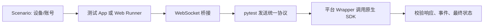

# IM Flutter SDK 5.0 自动化测试

## 这个项目做什么

用一套 Python pytest 用例，验证 Android、iOS、Web 5.0 的：

**API 响应 · 事件回调 · 本地状态 · 多设备 · 离线恢复**

## 项目建设内容

- 以 SDK 5.0 为基准，整理三端统一业务协议和 Wrapper 映射；
- 把 Case 统一为单端、双端、多设备拓扑、离线四类；
- 增加 `sender`、`recipient`、同账号副端等角色，验证事件实际投递端；
- 覆盖 Chat、Group、Chatroom、Contact、Push、UserInfo 等主要模块；
- 记录 Android/iOS 原生差异，区分 Case、Wrapper、SDK/服务端问题。

## 测试流程



## 代表性 Case

### 1. Chat 普通双设备消息收发

代表用例：`test_chat_missing_voice_message_send_receive`

**测试目标：**验证 A、B 两台设备之间一次普通消息收发的完整链路。

- **前置：**A、B 建立好友关系；A 使用发送设备，B 使用接收设备，并清理历史事件。
- **操作：**A 发送一条语音消息，记录发送响应中的临时 ID 和发送成功事件中的真实 `msgId`。
- **断言：**校验 A 的发送结果和 `onMessageSuccess`，以及 B 的 `onMessagesReceived`、消息 ID、发送方、接收方和消息内容。
- **价值：**用最简单的双设备场景验证 API 响应、事件回调和消息内容一致性。

### 2. Chat 离线消息恢复

代表用例：`test_chat_offline_text_message_received_after_login`

**测试目标：**验证 B 离线期间收到的消息，在重新登录后能否正常恢复。

- **前置：**A、B 建立好友关系；B 账号的所有接收设备退出登录，A 保持在线。
- **操作：**A 发送一条文本消息，记录真实 `msgId`。
- **恢复：**B 账号的所有接收设备重新登录，并分别监听 `onMessagesReceived`。
- **断言：**逐设备校验 B 收到消息的真实 `msgId`、发送方、接收方、会话 ID、消息类型和正文。
- **价值：**验证离线消息补投，区分“发送成功”和“接收端重新登录后真正收到消息”。

### 3. Chat 普通多设备消息收发

代表用例：`test_chat_missing_location_message_send_receive`

**测试目标：**验证 A、B 两个账号的全部在线设备，在普通在线发送场景下是否都能收到正确的消息同步；

- **前置：**A、B 建立好友关系；Scenario 为 A、B 分别配置一个或多个在线设备，并清空所有设备的历史事件。
- **操作：**A 账号选择一个动作设备发送位置消息，记录发送响应中的临时 ID 和 `onMessageSuccess` 中的真实 `msgId`。
- **A 账号校验：**动作设备校验 `sendMessage` 和 `onMessageSuccess`；A 账号的其他全部设备逐一校验 `onMessagesReceived`，并通过本地消息查询确认消息已经落库。
- **B 账号校验：**B 账号的全部接收设备逐一校验 `onMessagesReceived`，确认每个设备都收到同一个真实 `msgId` 和相同的位置内容。
- **价值：**验证“发送端动作设备、发送端其他设备、接收端全部设备”三类端点，避免只验证 A→B 的单条链路。

> 文档中的 A、B、C 表示账号，不表示设备数量。每个账号实际包含多少设备由 Scenario 决定；Case 使用 `sender_devices`、`recipient_devices` 等设备集合逐端验证。

这些 Case 不只验证“接口返回 true”，还验证了跨端事件、离线恢复、本地状态和最终业务结果。

## Important

```text
先选 Scenario
→ 明确单端/双端/拓扑/离线
→ 写清前置、动作、事件、状态、清理
→ 统一协议，平台 Wrapper 映射原生 API
→ 不为了 pass 伪造原生结果
```

详细运行方式看 `README.md`，平台差异看 `docs/Android5.0.md` 和 `docs/ios5.0.md`，Case 清单看 `docs/test-case-report/现有Case说明.md`。
